## Docker Volume contd..

* __Persisting Data using Volumes__

* Lets create an explicit volume for mysqldb
* Lets use volume type to mount the mysqldb
* Lets mount a volume using `-v` Refer Here:https://docs.docker.com/storage/volumes/#start-a-container-with-a-volume for official docs
* `docker volume create mysqldb`
* Create a mysql container
* `docker container run -d --name mysqldb -v mysqldb:/var/lib/mysql -P -e MYSQL_ROOT_PASSWORD=rootroot -e MYSQL_DATABASE=employees -e MYSQL_USER=qtdevops -e MYSQL_PASSWORD=rootroot mysql`

* Lets create some data and then delete the container 


* Now create a new container using mount `--mount`
* `docker container run -d --name mysqldb --mount "source=mysqldb,target=/var/lib/mysql,type=volume" -P -e MYSQL_ROOT_PASSWORD=rootroot -e MYSQL_DATABASE=employees -e MYSQL_USER=qtdevops -e MYSQL_PASSWORD=rootroot mysql`


```
docker volume ls
docker container ls
$ docker container exec -it mysqldb mysql --password=rootroot

```

```
 use players;
```
```
 CREATE TABLE Persons (
    ->     PersonID int,
    ->     LastName varchar(255),
    ->     FirstName varchar(255),
    ->     Address varchar(255),
    ->     City varchar(255)
    -> );

```
```
Insert into Persons values (1, 'anil','anil','anil','anil');
```
* There is no need insert data again if you have already created volume i.e: -->  Insert into Persons values (1, 'anil','anil','anil','anil');

```
Select * from Persons;
```
*  As we can see the data is persisted and is attached to new container. 
*  Lets use bindmount to mount /tmp on docker host to the container /tmp
`docker container run -d --name exp1 -v /tmp:/tmp ubuntu:22.04 sleep 1d`
* or 
`docker container run -d --name exp1 --mount "source=/tmp,target=/tmp,type=bind" ubuntu:22.04 sleep 1d`
* Login into container and create some data

* check the content in /tmp of docker host

## Creating volume as part of Dockerfile

* for spc
  
```
# Copy from local file on Docker host into docker image

COPY spring-petclinic-2.4.2.jar  /spring-petclinic-2.4.2.jar

EXPOSE 8080

CMD ["java", "-jar", "/spring-petclinic-2.4.2.jar"]

or 

# Copy from local file on Docker host into docker image
COPY spring-petclinic-2.4.2.jar  /spring-petclinic-2.4.2.jar
EXPOSE 8080
CMD ["sleep", "10s"]
```
* Gameoflife:

```
FROM tomcat:9-jdk8
LABEL author="khaja" organization="qt"
ARG GOL_URL=https://referenceapplicationskhaja.s3.us-west-2.amazonaws.com/gameoflife.war
ADD ${GOL_URL} /usr/local/tomcat/webapps/gameoflife.war
VOLUME "/usr/local/tomcat"
EXPOSE 8080
# IGNORING CMD as i want base image's CMD
```
* for the changeset with volume instruction for gameoflife container
* 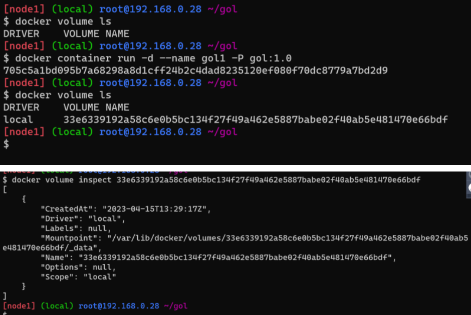
* ## Shell file to clean everything
* Create a shell file with following content

```
#!/bin/bash
docker container rm -f $(docker container ls -a -q)
docker volume prune
docker image rm -f $(docker image ls -q)

```


* ## Entrypoint and CMD
* Lets create two docker images
* First
```
FROM alpine
CMD ["sleep", "1d"]
```


* ## Experiment
* Create a alpine container with the following names
  
```
docker container run -d --name C1 alpine sleep 1d
docker container run -d --name C2 alpine sleep 1d

```
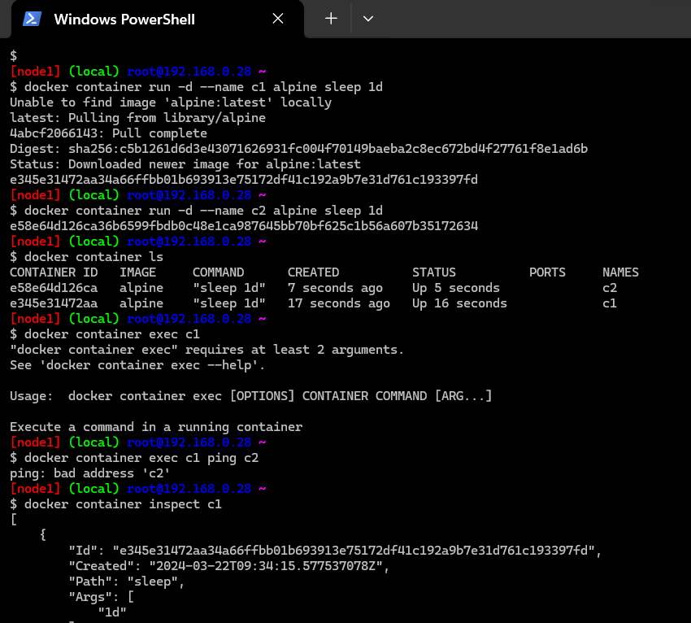
* Now run in C1 ping C2 (docker container exec C1 ping C2)
* Findout ip addresses of C1 container and C2 container by executing

```
docker container inspect C1
docker container inspect C2
```
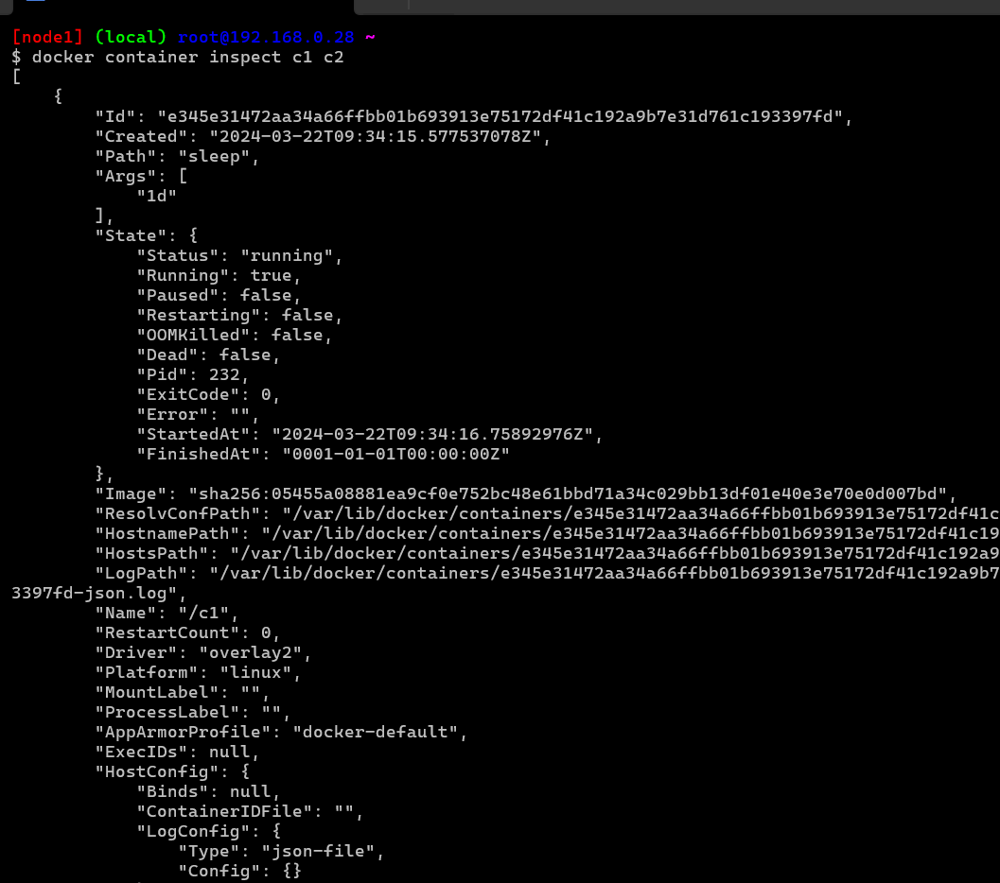
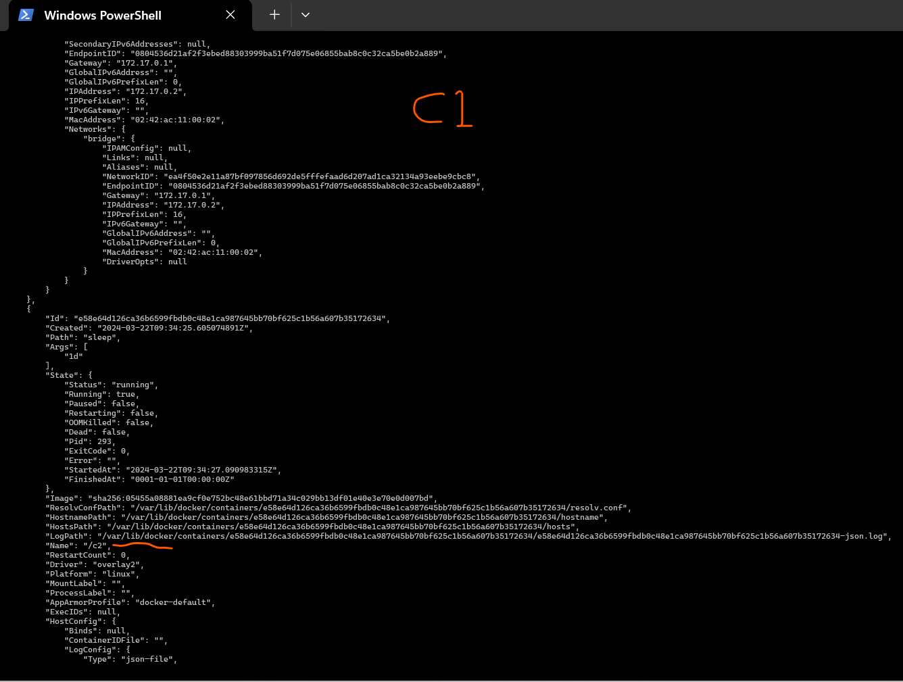
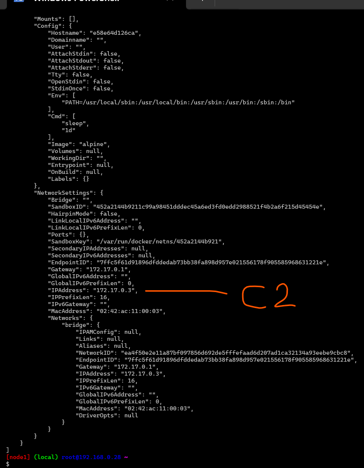

* Now login into C1 and ping C2 by using its ipaddress
* Observation Results
* ping by name is not working
* ping by ip is working
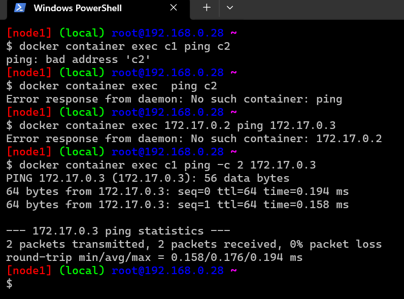

* Create an ubunutu linux vm
* install net-tools
```
sudo apt update && sudo apt install net-tools -y
ifconfig
```
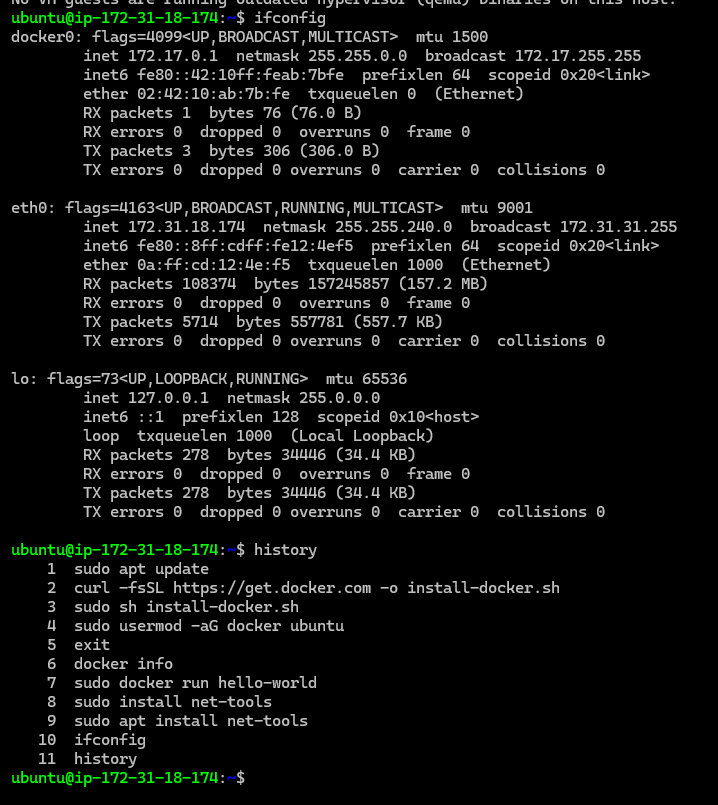
* A docker0 network interface is added.

## Docker Networks

*(1) the article on docker networking [refer here]
  
*  ## Docker Networking Series – I
* __Linux Networking Fundamentals__
* Docker networking uses the kernel’s networking stack to create high level networking feature of Docker
* __Docker Networking is Linux Networking__
* Also refer OSI Networking Model over here: https://en.wikipedia.org/wiki/OSI_model
  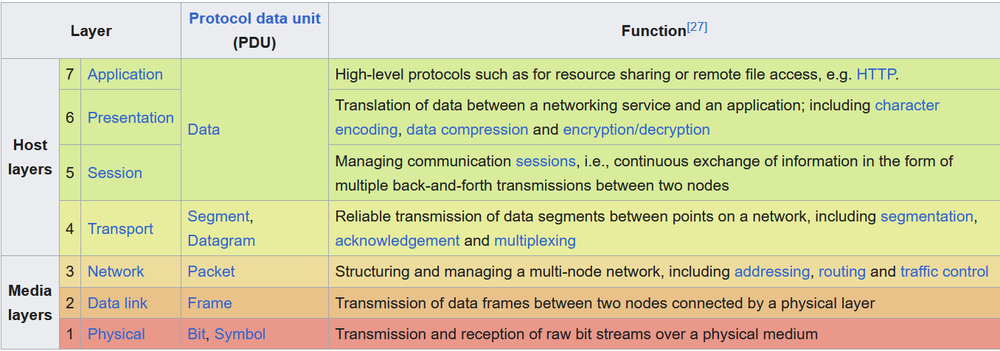
## Building Blocks

* ## Linux Bridge
* This is layer 2 device with virtual implementation of physical switch inside Linux Kernel
* Forwards the traffic based on MAC address by inspecting traffic.
* ## Network Namespace
     * Isolated network stack in kernel with its own interfaces, routes & firewall rules
* ## Virtual Ethernet Devices or veth
     *  Linux networking interface that acts as connecting wire between two two network namespaces
* ## iptables
     *  Generic table structure that defines rules & commands as part of the netfilter framework.
* ## Docker Networking Architecture
     *  Docker Networking Architecture is based on Container Networking Model.
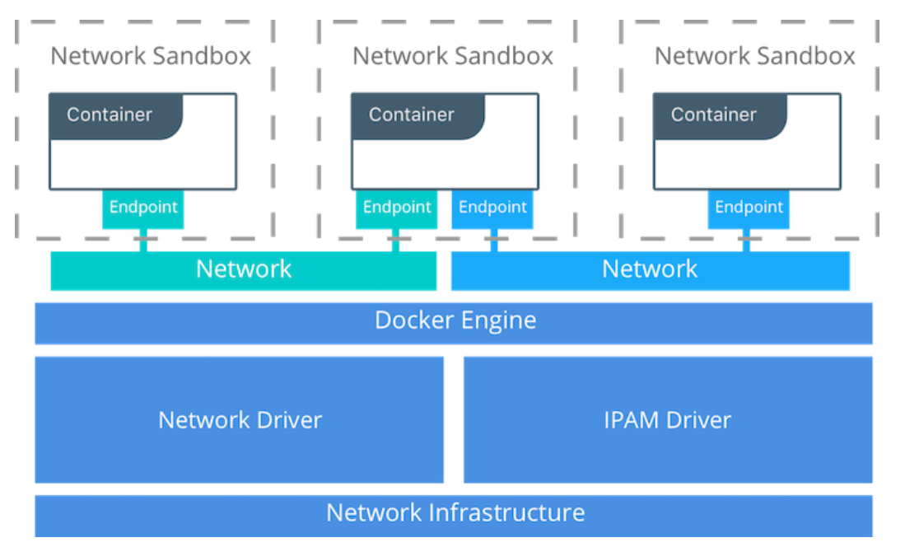
Image from Docker

* ## CNM Constructs – Sandbox
     * Contains the configuration of the containers network stack.
     * Includes routing tables, container’s interfaces, DNS setting etc.
     * Sample implementation could be Linux Network Namespace or any other similar concept.
* ## CNM Constructs – Endpoint
     * Joins sandbox to the Network.
     * This abstracts actual connection to the network away from application.
     * Maintains portability for applications, so that they can use different network drivers
* ## CNM Constructs – Network
     * Collection of endpoints having connectivity b/w themselves
* ## CNM Driver Interfaces
     * CNM provides two pluggable & open interfaces to leverage additional functionality and control in the network 
        * Network Drivers
        * IPAM Drivers
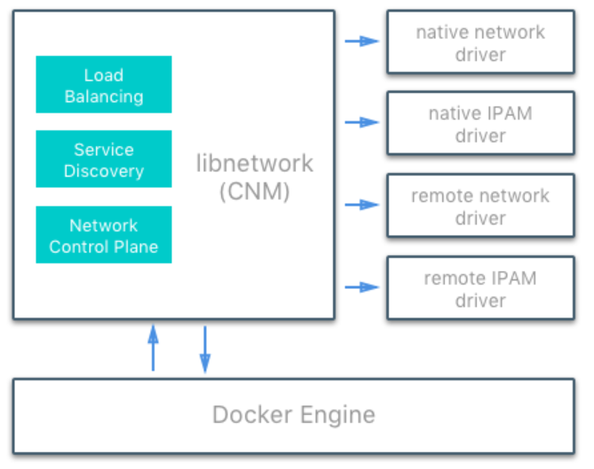
* ## Docker Native Network Drivers
     * ## Host
        * Container uses the networking stack of the host.
     * ## Bridge
        * Creates a bridge on the host that is managed by Docker.
        * All containers on Bridge Driver can communicate among themselves
        * Default Driver
     * ## Overlay
        * Used for multi-host networks.
        * uses local linux bridges & VXLAN to overlay container-to-container networking
     * ## MACVLAN
        * uses Linux MACVLAN bridge to establish connection b/w container interfaces & parent host interfaces
        * MAC address can be attached to each container
     * # none 

* ## Docker Networking Scopes
     * Local: provides connectivity within host
     * Swarm: provides connectivity across swarm cluster
* ## Tutorials
     * https://docs.docker.com/network/network-tutorial-standalone/
     * https://docs.docker.com/network/network-tutorial-host/
     * https://docs.docker.com/network/network-tutorial-overlay/
* ## Host Network Driver
     * In host network driver all the containers are in same network namespace(sandbox)
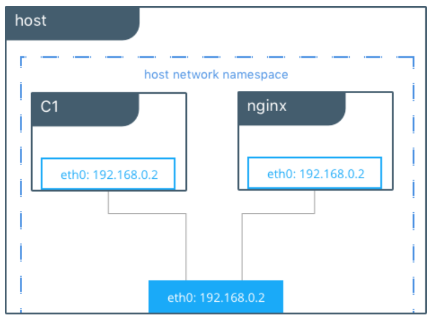
* ## Bridge Network Driver
* __Default Bridge Network Driver__
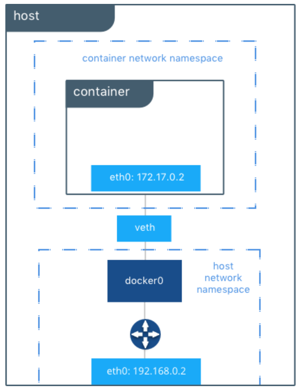
* ## User-Defined Bridge Networks
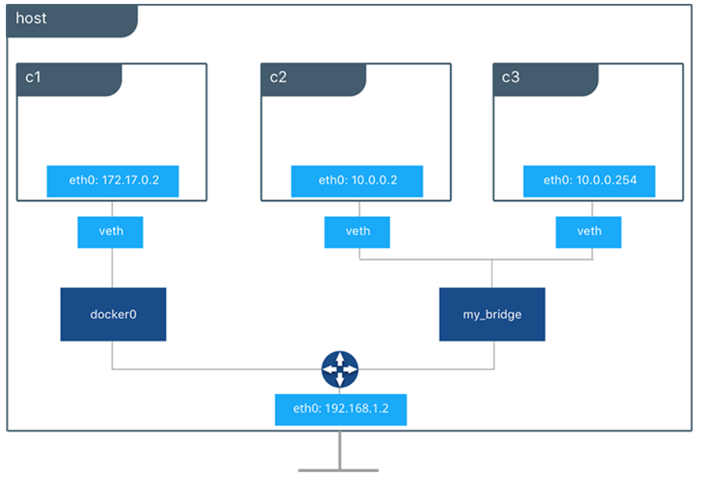
* note: All the images are picked from Docker Documentations 
* (2) Docker has multiple network driver implementations 
     * bridge
     * host
     * macvlan
     * overlay
* __Bridge__
     * Default bridge will not have dns enabled (this is why in the above experiment C1 was not able to ping C2 by name)
     *  Create a container C1 in default network `docker container run -d --name C1 alpine sleep 1d` 
     *  inspect default bridge network `docker network inspect bridge`
 