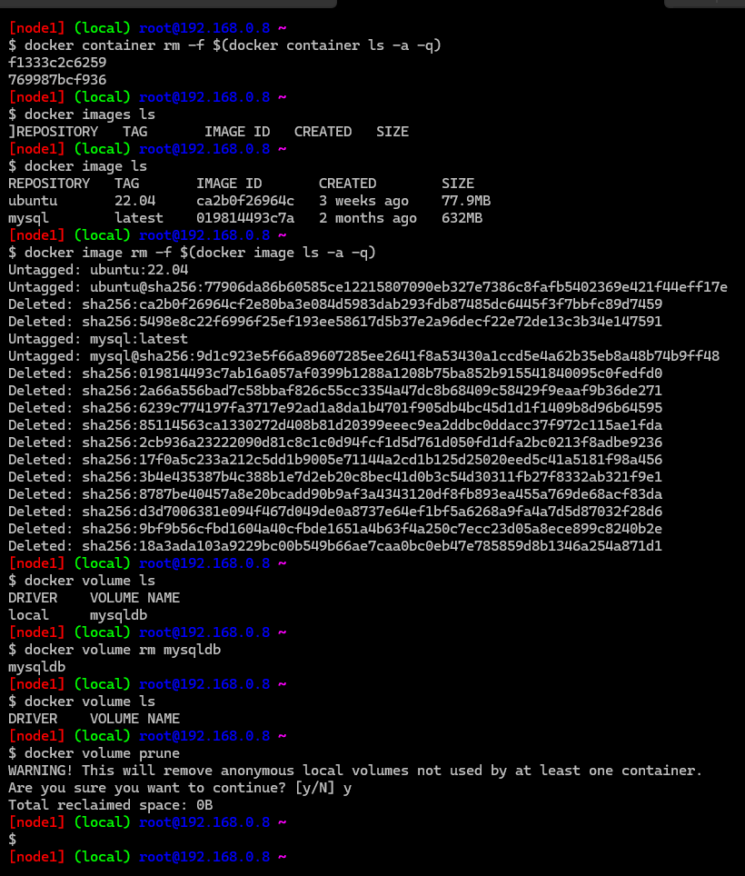
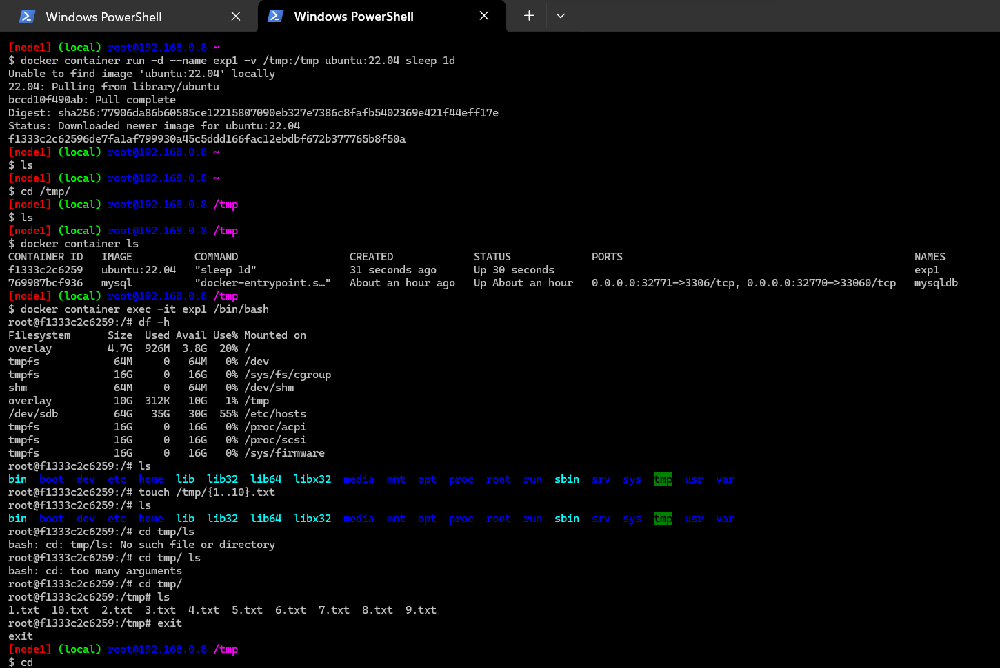

## Docker Volume contd..

* __Persisting Data using Volumes__

* Lets create an explicit volume for mysqldb
* Lets use volume type to mount the mysqldb
* Lets mount a volume using `-v` Refer Here:https://docs.docker.com/storage/volumes/#start-a-container-with-a-volume for official docs
* Create a mysql container
* `docker container run -d --name mysqldb -v mysqldb:/var/lib/mysql -P -e MYSQL_ROOT_PASSWORD=rootroot -e MYSQL_DATABASE=employees -e MYSQL_USER=qtdevops -e MYSQL_PASSWORD=rootroot mysql`

* Lets create some data and then delete the container 

* Now create a new container using mount
* `docker container run -d --name mysqldb --mount "source=mysqldb,target=/var/lib/mysql,type=volume" -P -e MYSQL_ROOT_PASSWORD=rootroot -e MYSQL_DATABASE=employees -e MYSQL_USER=qtdevops -e MYSQL_PASSWORD=rootroot mysql`
* 
![preview](images
![preview](images

