## Understanding Multi-Host Networking

* Multi-host networking is created as part of docker orchestration called as `SWARM` 
* Refer Here: https://directdevops.blog/2019/10/07/docker-networking-series-ii-overlay-networks/ for multi host networking and Refer Here: https://directdevops.blog/2019/10/07/docker-swarm-mode/ for swarm
* According to what we have learnt so far. Communication between containers in same host is possible using bridge or macvlan etc. but communication between two containers running on two different hosts is not possible
* 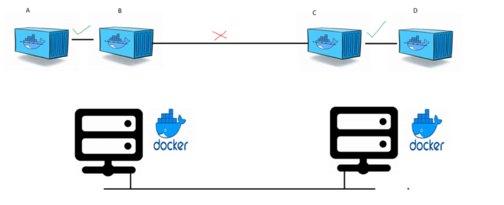
* Docker has a netwok driver called as overlay network
* Using vxlan, overlay networks use underlay to create a virtual network which is logical and appears as if the containers across hosts are connected to the same network
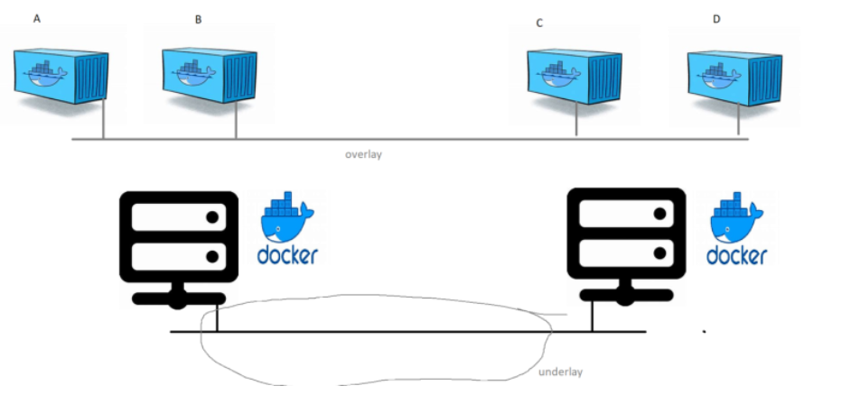
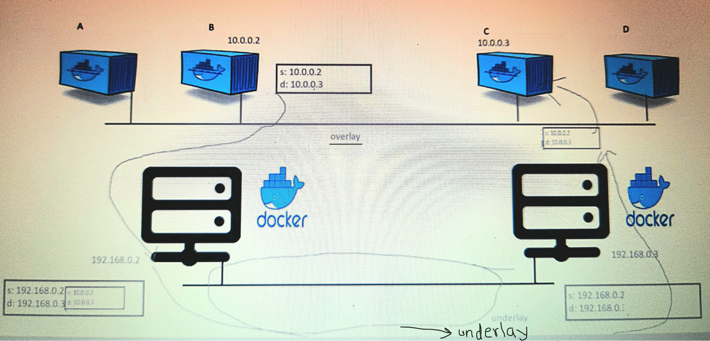

## Docker Swarm Mode

* __Docker Swarm__
* The cluster maanagement & Orchestration features are embedded inside Docker Engine.
* Docker swarm consists of multiple docker hosts which run in swarm mode.
* Two Roles managers and workers exist in Docker swarm
* Manager is responsible for membership & delegation
* Worker is responsible for running swarm services
* Each Docker Host can be a manager, a worker or both.
* In Docker Swarm Desired State is maintained. For instance if you are running one container in swarm on a particular node (Worker) and that node goes down, then Swarm schedules this nodes task on other node to maintain the state.
* Task is a running container which is part of swarm service managed by Swarm Manager

* __Nodes__

* It is instance of the docker engine participating in Swarm.
* There are two kinds of nodes
       * Manager nodes:
           * You communicate to manager node to deploy applications in the form of Service Definitions.
           * Manager nodes dispatch unit of work called as tasks to the Worker ndoes
       * Worker nodes:
           * They receive & execute the tasks dispatched from manager nodes.
           * An agent runs on the worker node & reports on the tasks assigned to it

* __Services and tasks__

* Service is the definition of the task to be executed.
* Typically it would be the application to be deployed.
* Two kinds of Service models are available
       * __Replicated Services model__ : In this case swarm manager distributes a specific number of replica task among the nodes based upon the scale you set in the desired state
       * __Global Services Model__: In this case swarm runs one task for the service on every available node in the cluster.
  
* __Task__

* carries a Docker container and the commands to run inside the container.
* It is the atomic secheduling unit of swarm.
* Once a task is assigned to node, it cannot move to another node.
* It can only run on the assigned node or fail.

* __Swarm Setup__

* In this series, I would be using 3 ubuntu 18 machines.
* One would be manager & other two would be workers.
* Install docker on all the machines by following instructions from here
* Login into ssh session of the machie which would be manager.
* Ensure all the machines can be communicated (or pingable from manager)
* Make a note of private ip address of the manager (In this example the managers ip address would be 172.31.42.125) and then exec

```
## this means create a docker swarm cluster 
docker swarm init --advertise-addr <Manager-ip>

# In my case this is
docker swarm init --advertise-addr 172.31.42.125

##Outpu###
Swarm initialized: current node (uyclb1gbhhqhlo80aq7zhx2z4) is now a manager.

To add a worker to this swarm, run the following command:

    docker swarm join --token SWMTKN-1-1w51ouq6zrmts85l71z53ruqcc1pivzprpigdodspu58o7dp3z-172clbo51xq8w7uwizm8cc19t 172.31.42.125:2377

To add a manager to this swarm, run 'docker swarm join-token manager' and follow the instructions.

```
* create 3 instances or create 3 node from docker playground 
* 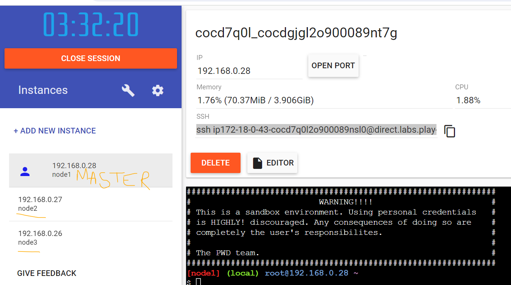
* make 1 node to master using command `docker swarm init --advertise-addr 192.168.0.28`
* 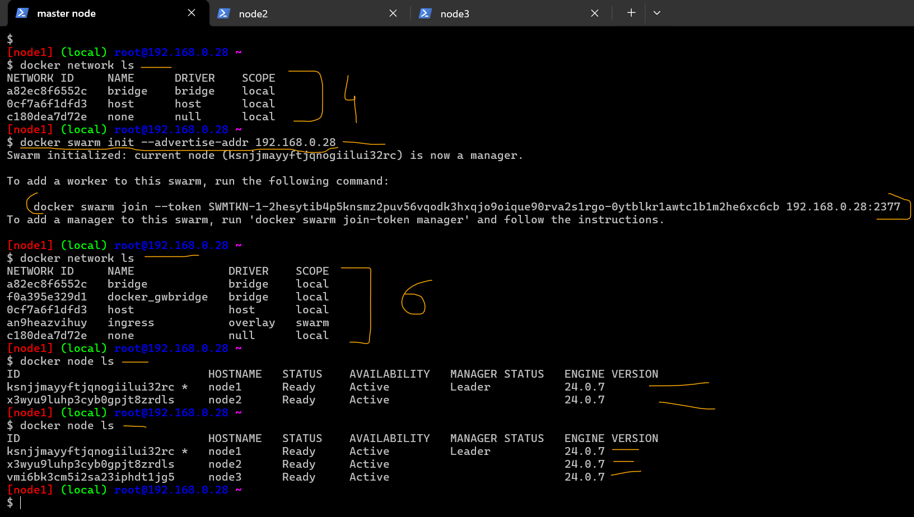
* copy these command and paste on node2 and node3 to make them worker node of master node `    docker swarm join --token SWMTKN-1-2hesytib4p5knsmz2puv56vqodk3hxqjo9oique90rva2s1rgo-0ytblkr1awtc1b1m2he6xc6cb 192.168.0.28:2377`
* 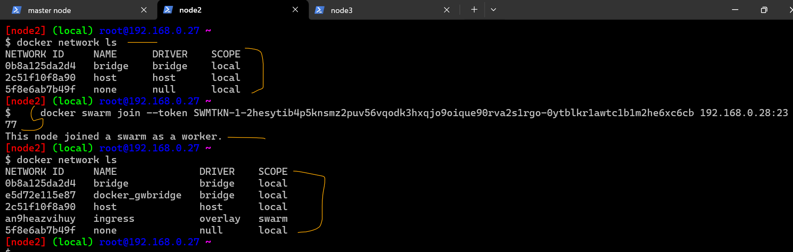
* 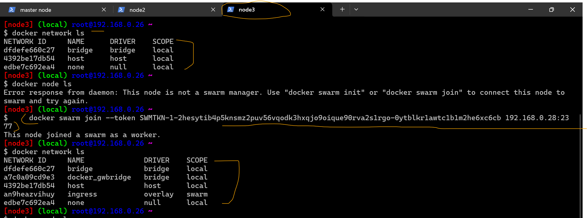
 
* Execute `docker info` on the manager and observe the output should consists of Swarm: active and other info about Docker Swarm.
* Execute command `docker node ls` and you should see the status of the manager node
* Now login into other nodes and execute docker swarm join command which is output of the docker swarm init command as mentioned above.

```
docker swarm join --token SWMTKN-1-1w51ouq6zrmts85l71z53ruqcc1pivzprpigdodspu58o7dp3z-172clbo51xq8w7uwizm8cc19t 172.31.42.125:2377

##Output##
This node joined a swarm as a worker.
```

* Now ssh into the manager and execute docker node ls and you should be able to see three nodes information.

* Lets create a tomcat service by using the following command
`docker service create --replicas 2 --name tomcat tomcat:8`
* or
* `docker service create --replicas 2 --name ngnix-svc ngnix`
* 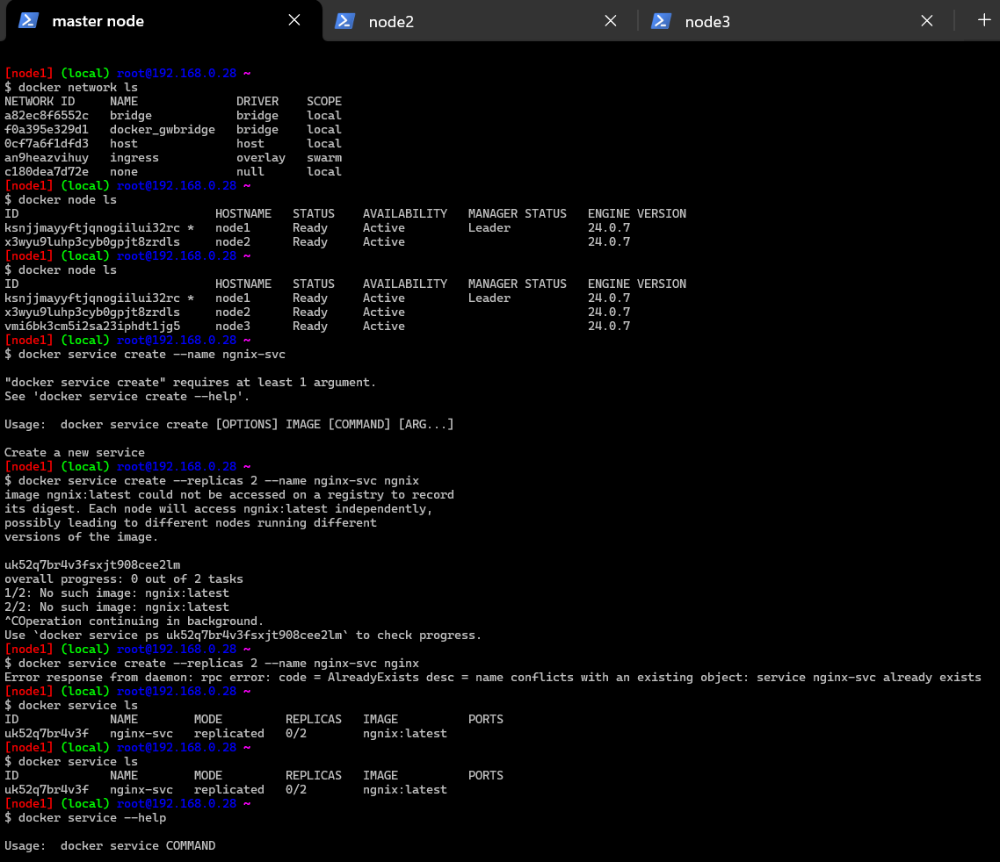
* 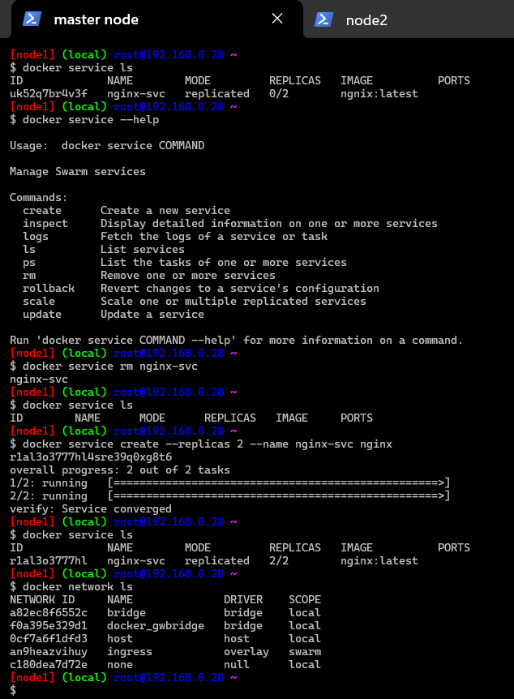
* This command leads to creation of tasks and output would be like
```
tvdml6nt5dryszozaydr8sv8o

overall progress: 2 out of 2 tasks                                            
1/2: running   [==================================================>]

2/2: running   [==================================================>]
verify: Service converged
```

* Execute `docker service ls` and the possible output would look like

```
ID                  NAME                MODE                REPLICAS            IMAGE               PORTS
tvdml6nt5dry        tomcat              replicated          2/2                 tomcat:8

```
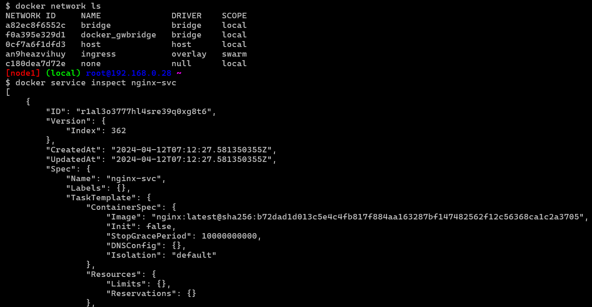
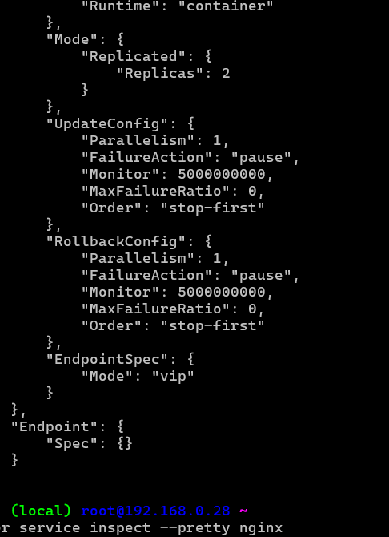

* Lets inspect the service using `docker service inspect nginx-svc --pretty` and the output of the command would be
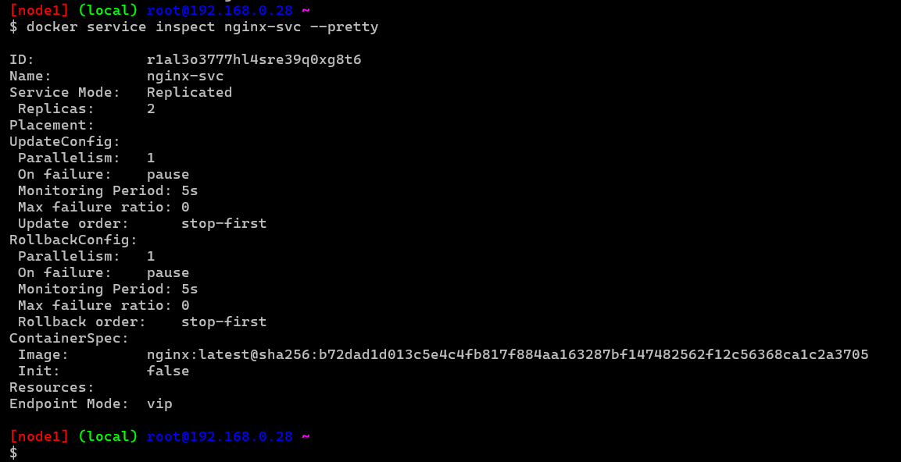
```
ID:             r1al3o3777hl4sre39q0xg8t6
Name:           nginx-svc
Service Mode:   Replicated
 Replicas:      2
Placement:
UpdateConfig:
 Parallelism:   1
 On failure:    pause
 Monitoring Period: 5s
 Max failure ratio: 0
 Update order:      stop-first
RollbackConfig:
 Parallelism:   1
 On failure:    pause
 Monitoring Period: 5s
 Max failure ratio: 0
 Rollback order:    stop-first
ContainerSpec:
 Image:         nginx:latest@sha256:b72dad1d013c5e4c4fb817f884aa163287bf147482562f12c56368ca1c2a3705
 Init:          false
Resources:
Endpoint Mode:  vip
```
* so where are those services are running to know that use command `docker service ps ngnix-svc`
* 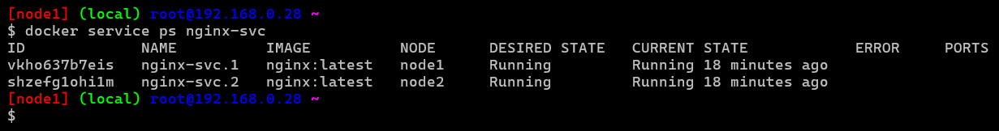
* 
* Execute `docker service ps nginx-svc` command to findout on which node the tasks are executed.
* Lets scale the number of containers running `nginx` by using the following command `docker service scale nginx-svc=4` and the output would be
* 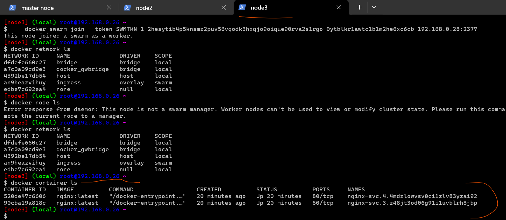
* 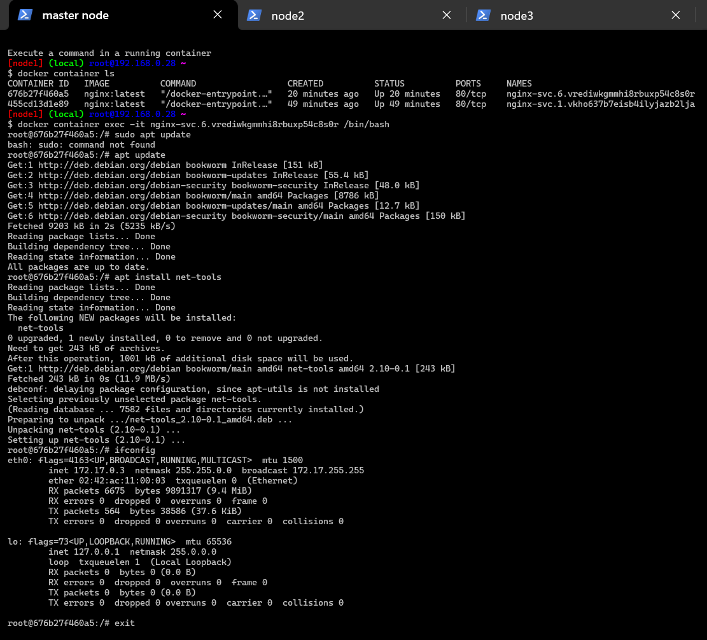
* 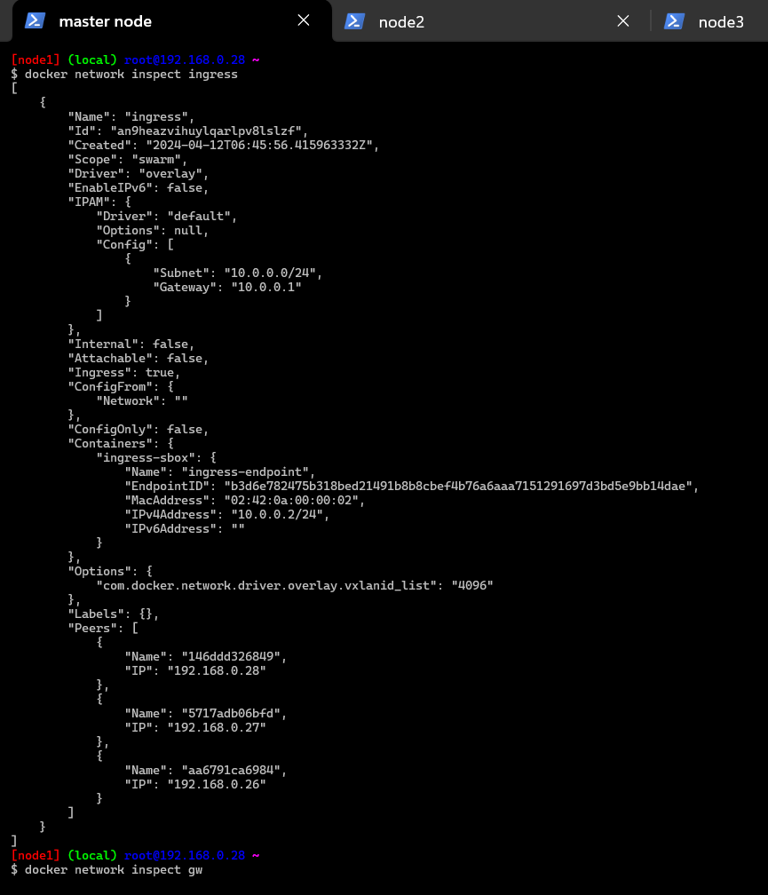
* 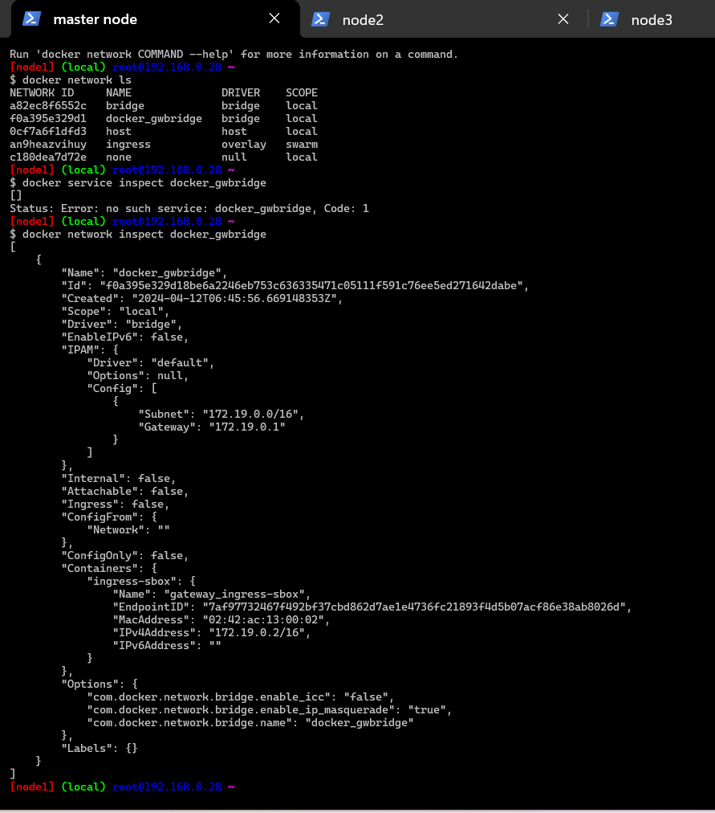

* `docker service scale nginx-svc=4` `docker service scale nginx-svc=6` 

```
nginx scaled to 4 or 6 
overall progress: 4 out of 4 tasks                                                                             
1/4: running   [==================================================>]                                         
2/4: running   [==================================================>]                                           
3/4: running   [==================================================>]                                           
4/4: running   [==================================================>]                                           
verify: Service converged 
```
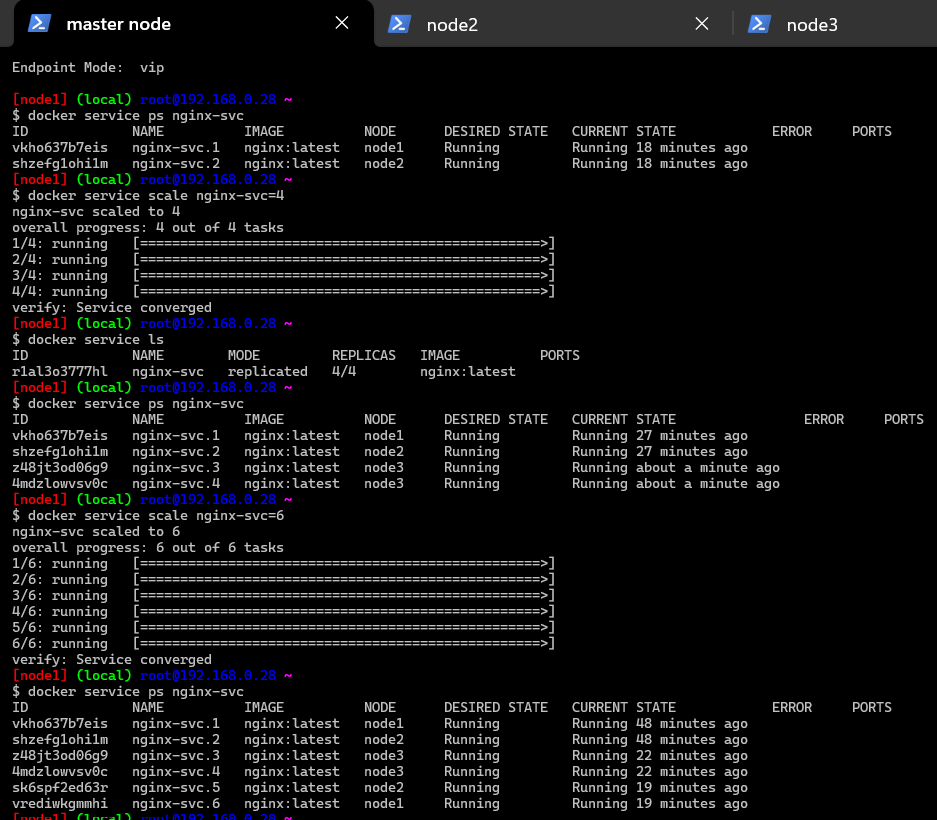

* This service are called as orchestration 
* 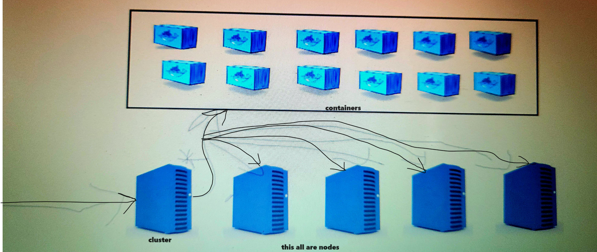
* Service can be deleted using the follwing command `docker service rm nginx`
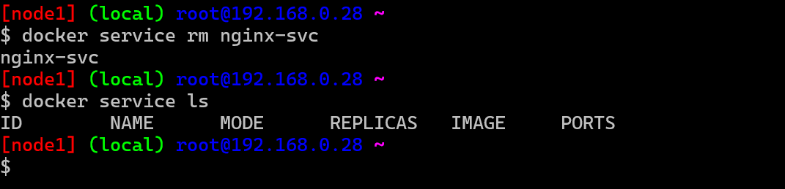

* __Rolling updates to docker swarm__

* Execute the following command to deploy jenkins
```
docker service create --name jenkins --replicas 2 --update-delay 10s --publish published=8081,target=8080 jenkins:1.609.1


```

* Now navigate to ipaddress of any node and http://<nodip&gt;:8081
* Now lets try to update to the newer version of jenkins
* `docker service update --image jenkins:latest jenkins`

__Relevance to Docker Networking__

* In this series so far we were able to run docker containers on different nodes from swarm manager.
* Now execute this command docker network ls on the manager and you should see the output which would look like
```
NETWORK ID          NAME                DRIVER              SCOPE
4fa602b7a4ec        bridge              bridge              local
c3ba8230b575        docker_gwbridge     bridge              local
436956ab2dd0        host                host                local
m6zbhh5cn5ag        ingress             overlay             swarm
dfa793d07248        none                null                local
```
* In this overlay network driver is used and scope for that driver is swarm.
* So we can conclude that Docker swarm uses overlay and bridge (docker_gwbridge) to enable multiple Docker Host Communications.

* __How Docker Swarm Works?__

* Docker swarm uses RAFT Consensus Algorithm to maintain a consistent internal state of the entire swarm and all the services running on it.

* __Manager Nodes__

* Manager nodes handle cluster management tasks
      * cluster state management
      * service scheduling
      * serving Swarm mode
* To take advantage of swarm mode’s fault-tolerance features, Docker recommends you implement an odd number of nodes according to your organization’s high-availability requirements. When you have multiple managers you can recover from the failure of a manager node without downtime.

```
* A three-manager swarm tolerates a maximum loss of one manager.
* A five-manager swarm tolerates a maximum simultaneous loss of two manager nodes.
* An N manager cluster tolerates the loss of at most (N-1)/2 managers.
* Docker recommends a maximum of seven manager nodes for a swarm.

```
* __Worker Nodes__

* Instance of Docker Engine whose purpose is to execute containers
* They dont participate in Raft distributed state or any of the managers tasks.
* Worker Node can be made Manager node by using `docker node promote`. note: This has to be executed by Manager Node

* __Docker Service LifeCycle__

* External Access For Docker Services

* __Ingress Mode Service Publishing__

`docker service create --replicas 2 --publish mode=ingress,target=80,published=8080 nginx`

* This mode publishes the exposed port on every Swarm node.
* Load balancing happens in this mode

* __Host Mode Service Publishing__

* `docker service create --replicas 2 --publish mode=host,target=80,published=8080 nginx`

* In this mode the published port is exposed on the host where this service is running
* Load balancing doesn’t happen
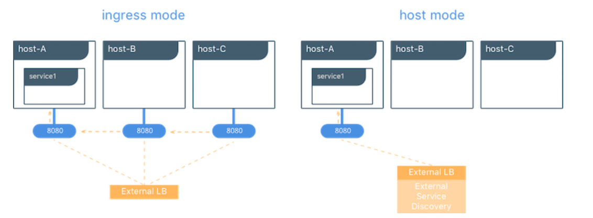


* To create multi host network, we need to create docker swarm cluster.
* Swarm cluster provides native docker container orchestration.
* Some of the activities the cluster performs
       * Maintains the desired state.
       * Performs scaling
       * chooses the master node (manager)
       * ability to add docker hosts to the cluster

* ## Exercise

* Refer Here: https://directdevops.blog/2019/10/07/docker-logging-docker-memory-cpu-restrictions/  and execute the commands and understand
* https://www.youtube.com/watch?v=ggOmHlnhPaM&list=PLuVH8Jaq3mLud3sVDvJ-gJ__0zd15wGDd&index=15 : Refer Here for understanding yaml and json


