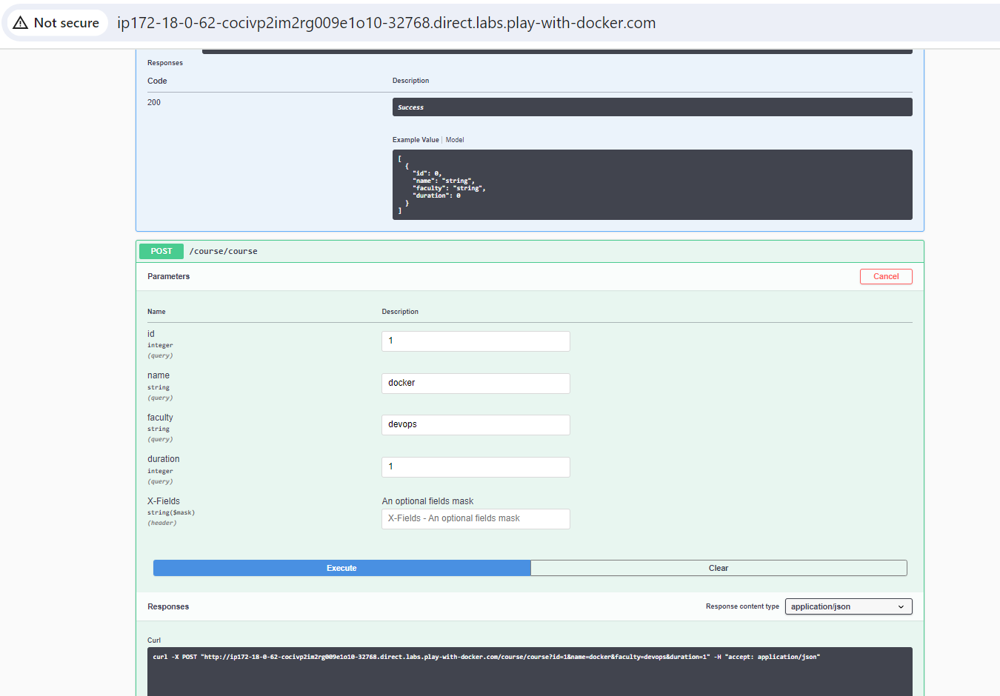

## A Sample application

* Python based application:
     * Web application
     * Database

* Code: Refer Here: https://github.com/DevProjectsForDevOps/StudentCoursesRestAPI
* This application has a python web frontend.
* Create a image by following instructions Refer Here: https://directdevops.blog/2019/11/02/deploying-the-docker-application-and-mysql-with-volume-support-into-kubernetes-from-code-to-docker-registries-like-acr-ecr-and-then-to-eks-aks/
* Create a mysql container according to docs
* get the mysql ip address and pass it as environment variable to the python web application
* What is that you need to do
       * Create a bridge network
       * Create a volume and attach it to mysql container
       * Resolve the mysql container by its name
* ## To do this
```
git clone https://github.com/DevProjectsForDevOps/StudentCoursesRestAPI.git
cd StudentCoursesRestAPI
docker image build -t scr:latest
docker network create -d bridge scr_bridge
docker volume create scr_db
docker container run -d --name mysql -e MYSQL_ROOT_PASSWORD=password -e MYSQL_DATABASE=test -e MYSQL_USER=directdevops -e MYSQL_PASSWORD=directdevops --network scr_bridge -v scr_db:/var/lib/mysql mysql:5.6
docker container run -d --name mypythonapp -e MYSQL_SERVER=mysql --network scr_bridge -P scr:latest
```
#### lets start using above commands

* Take 1 instance from docker playground 
* 
* 
* go to docker playground and open port on web page `32768` for check its running or not. 
* 
* 
  
  ## Docker compose 

* Take 1 instance from docker playground 
* 
* 
* 

* To do this we have to understand below docker compose file , how its actually works.
* refer here: https://github.com/DevProjectsForDevOps/StudentCoursesRestAPI/blob/master/docker-compose.yaml
```
---
version: "3.9"
services:
  student-srv:
    build: 
      context: .
    networks:
      - students-net
      - students-private-net
    ports:
      - target: 8080
        published: 8080
        protocol: tcp
        mode: host
    environment:
      - MYSQL_SERVER=students-db
    depends_on:
      - students-db
  students-db:
    image: mysql:5.6
    networks:
      - students-private-net
    environment:
      - MYSQL_ROOT_PASSWORD=password
      - MYSQL_DATABASE=test
      - MYSQL_USER=directdevops
      - MYSQL_PASSWORD=directdevops
    volumes:
      - type: volume
        source: students-db
        target: /var/lib/mysql

volumes:
  students-db:

networks:
  students-net:
    driver: bridge
    ipam:
      config:
        - subnet: 192.168.101.0/24
  students-private-net:
    driver: bridge
    ipam:
      config:
        - subnet: 192.168.102.0/24
```

-------------------------------------------------------------------------------------------------------------------

* ## Deploying Python Flask Rest Application to Kubernetes
* In this series we would take a simple python flask Application with the architecture as shown below

* The code of this application is hosted over here: https://github.com/DevProjectsForDevOps/StudentCoursesRestAPI
* ## Understanding Application Execution
* Before we build the docker image for this application, lets understand the steps for executing this application.
* Ensure python3 and pip is installed and then execute the following commands in the terminal
```
git clone https://github.com/DevProjectsForDevOps/StudentCoursesRestAPI.git
cd StudentCoursesRestAPI
pip install -r requirements.txt
python app.py
```
* This application is configured to run on port 8080. so navigate to the http://<ip address>:8080. Home page will be launched with swagger ui, where the apis can be executed.
* 
* ## Building Docker Image for this application
* Based on the steps mentioned over the above section, we need a source docker image with python3 and pip
* I would be using official python image with tag 3.7-alpine.
* Dockerfile will have the following contents
```
FROM python:3.7-alpine
LABEL author=KHAJA
LABEL blog=directdevops.blog
ARG HOME_DIR='/studentcourses'
ADD . $HOME_DIR
ENV MYSQL_USERNAME='directdevops'
ENV MYSQL_PASSWORD='directdevops'
ENV MYSQL_SERVER='localhost'
ENV MYSQL_SERVER_PORT='3306'
ENV MYSQL_DATABASE='test'
EXPOSE 8080
WORKDIR $HOME_DIR
RUN pip install -r requirements.txt
ENTRYPOINT ["python", "app.py"]
```
* Now build the image using the following command
`docker image build -t src: latest . or docker build image -t studentcourserestservice:1.0 .`

* Now to test this image we need the mysql container from here to be created. Lets create the mysql container using the following command

`docker container run -d --name mysql -e MYSQL_ROOT_PASSWORD=password -e MYSQL_DATABASE=test -e MYSQL_USER=directdevops -e MYSQL_PASSWORD=directdevops mysql:5.6`

* Find the ip address of the mysql container using
`docker inspect mysql or docker inspect mysql | grep IPAddress`

* and make the note of ip. (In my case it is 172.17.0.2)

* Now create a container with studentcourserestservice image using the following command

`docker container run -d --name mypythonapp -e MYSQL_SERVER=172.17.0.2 -p 8080:8080 studentcourserestservice:1.0`

* Now navigate to http:<ip address>:8080 and initialize database and select Execute button


#### 