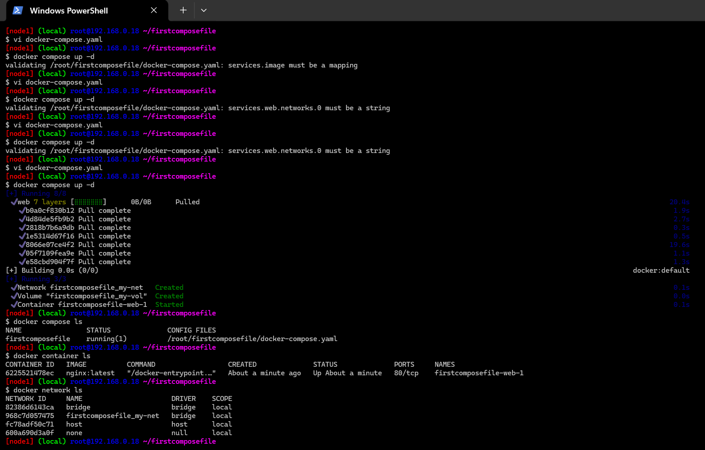
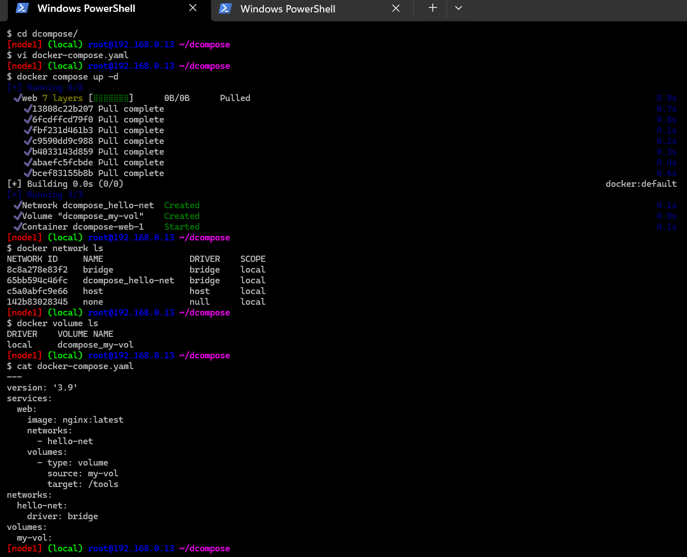

## YAML

* This is data representation format, which uses name/value pairs
* It is collection of name value or key value pair used to represent data.
* Generally it is stored in files with extension .yml or .yaml

* The basic format is `<name>: <value>`
* `topic: Docker`

*  Values can be of different types / types of data

* Simple
     * text: can be represented in single or double quotes tool: ansible
     * number: numbers in non quote format `age: 10`
     * boolean: true, false, yes, no `online: yes`   
  
       * Simple/Scalar
           * Text
           * number
           * boolean

* Complex
     
     * list: array
       colors:
         – black
         – white
     
       * Complex
        
           * list/array
           * map/dictionary/object

* Extension of YAML files is `.yaml` or `.yml.` YAML is a text file
* Simple yaml 

```
url: directdevops.blog
author: khaja
isDailyUpdated: true
isLoginRequired: false
articlecount: 1000
```

* List example

```
---
Colors:
  - Black
  - White
Movies:
  - Avengers
  - Batman Begins

```

* Map/Dictionary/object

```
---
Address:
  flatno: 407
  building: Mythrivanam
  area: Ameerpet
  city: Hyderabad
```

* yaml about Quality Thought

```
---
name: QualityThought
url: https://qualitythought.in
courses:
  - name: Azure
    faculty: khaja
    duration: 90
  - name: AWS
    faculty: khaja
    duration: 90
  - name: DevOps
    faculty: khaja
    duration: 110
  - name: Manual Testing
    faculty: Ramana
    duration: 60
Branches:
  headoffice:
    flatno: 302
    building: nilgiri
    city: hyderabad
  devops:
    flatno: 407
    building: mythrivanam
    city: hyderabad
```

* We have list out names/keys then we need fill values
  
```
name = text
phone number = text
email text
professional summar text
skillset
   <skill name>: <skill values>
work experience: 
    experience list:
        company name
        duration
        role and responsibilities: text array/list

```


* Try writing about yourself in a yaml according to following structure

```
---
#qualification
yearofpassing: <number>
university: <text>
grade: text (A+|A|B|C)
----
# education
<name>: <qualification>

----
name: <text>
mobile: <text>
email: <text>
education: list(<education>)
```

* Example 1 (Postgraduate)

```
---
name: vishnu
mobile: '999999999'
email: vishnu@gmail.com
education:
  - mtech:
      yearofpassing: 2017
      university: jnu
      grade: A
  - btech:
      yearofpassing: 2015
      university: jntu
      grade: A+
```

* Example (graduate – BSc)

```
---
name: Swathi
mobile: '88888888'
email: swathi@outlook.com
education:
  - BSc:
      yearofpassing: 2020
      university: osmania
      grade: A+
```

* YAML will be used to define kuberentes manifests and docker compose files
* YAML documentation from ansible refer here: https://docs.ansible.com/ansible/latest/reference_appendices/YAMLSyntax.html

## Docker compose 

* This was external tool, but now it is integrated as docker subcommand `docker compose`
* Compose allows use to specify the yaml file which helps in creating the below by specifying in a yaml file
       * networks
       * volumes
       * containers
 
* docker compose file will have the name of `docker-compose.yml`
* sample
```
---
version: '3.9'
services:
  web:
    image: nginx:latest
    networks:
      - hello-net
    volumes:
      - type: volume
        source: my-vol
        target: /tools
networks:
  hello-net:
    driver: bridge
volumes:
  my-vol:


  or 

---
version: '3.9'
services:
  web:
    image: nginx:latest 
    networks:
      - my-net
    volumes:
      - type: volume
        source: my-vol
        target: /tools
networks:
  my-net:
    driver: bridge
volumes:
  my-vol:

```



* to start all the containers create a folder copy the docker-compose.yaml and execute docker compose up -d and to remove every thing docker compose down
* for the compose file with instructions to run student course register which we have executed manually yesterday
refer here: https://github.com/DevProjectsForDevOps/StudentCoursesRestAPI/blob/master/docker-compose.yaml

```
---
version: "3.9"
services:
  student-srv:
    build: 
      context: .
    networks:
      - students-net
      - students-private-net
    ports:
      - target: 8080
        published: 8080
        protocol: tcp
        mode: host
    environment:
      - MYSQL_SERVER=students-db
    depends_on:
      - students-db
  students-db:
    image: mysql:5.6
    networks:
      - students-private-net
    environment:
      - MYSQL_ROOT_PASSWORD=password
      - MYSQL_DATABASE=test
      - MYSQL_USER=directdevops
      - MYSQL_PASSWORD=directdevops
    volumes:
      - type: volume
        source: students-db
        target: /var/lib/mysql

volumes:
  students-db:

networks:
  students-net:
    driver: bridge
    ipam:
      config:
        - subnet: 192.168.101.0/24
  students-private-net:
    driver: bridge
    ipam:
      config:
        - subnet: 192.168.102.0/24
        
```
* version: "3.9": Specifies the version of the Docker Compose file format being used. In this case, it's version 3.9.

* services:: This keyword starts the section where you define the services (containers) that make up your application.

* student-srv:: This is the name of the service. It's the name you'll use to reference this service in other parts of the Docker Compose file or when interacting with Docker.

* build: context: .: Specifies that the Dockerfile for building the Docker image for this service is located in the current directory ("."). The context is typically the directory containing the Dockerfile.

* networks:: Defines the networks that this service should be connected to.

* - students-net: Connects this service to the students-net network.

* - students-private-net: Connects this service to the students-private-net network.

* ports:: Defines the ports to expose on the container.

* - target: 8080: Specifies the port that the container listens on.

* published: 8080: Specifies the port on the host machine to which the container's port is mapped.

* protocol: tcp: Specifies the protocol (TCP) for the port.

* mode: host: Binds the container's port directly to the host's port.

* environment:: Sets environment variables for the service.

* - MYSQL_SERVER=students-db: Sets the environment variable MYSQL_SERVER to the hostname of the MySQL server (students-db).

* depends_on:: Specifies dependencies between services.

* - students-db: Specifies that this service depends on the students-db service.

* students-db:: Defines another service named students-db.

* image: mysql:5.6: Specifies the Docker image to use for this service, in this case, MySQL version 5.6.

* environment:: Sets environment variables for the MySQL service.

* - MYSQL_ROOT_PASSWORD=password: Sets the password for the MySQL root user.

* - MYSQL_DATABASE=test: Specifies the name of the initial database to create (test).

* - MYSQL_USER=directdevops: Specifies the username of a new MySQL user (directdevops).

* - MYSQL_PASSWORD=directdevops: Specifies the password for the new MySQL user.

* volumes:: Specifies volumes to mount into the container.

* - type: volume: Defines the type of volume to mount.

* source: students-db: Specifies the name of the volume.

* target: /var/lib/mysql: Specifies the mount point inside the container.

* volumes:: Defines named volumes.

* students-db:: Specifies a named volume named students-db.

* networks:: Defines custom networks.

* students-net:: Defines a custom network named students-net.

* driver: bridge: Specifies the network driver to use (in this case, the default bridge driver).

* ipam:: Specifies IP Address Management (IPAM) options for the network.

* - subnet: 192.168.101.0/24: Specifies the subnet for the network.

* students-private-net:: Defines another custom network named students-private-net.

* driver: bridge: Specifies the network driver to use (bridge).

* ipam:: Specifies IPAM options for the network.

* - subnet: 192.168.102.0/24: Specifies the subnet for the network.

* This Docker Compose file sets up two services: student-srv and students-db, along with custom networks and volumes. student-srv is a service for an application, and students-db is a MySQL database service. The two services are connected to custom networks, and the database service has a named volume for persisting data.
