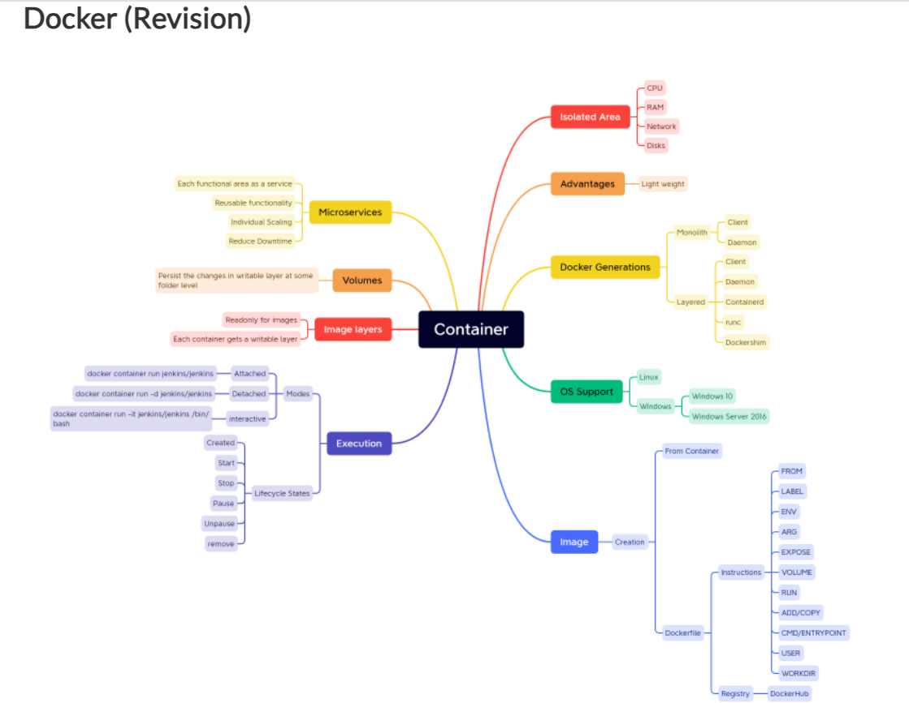
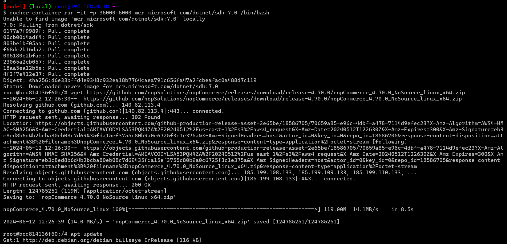
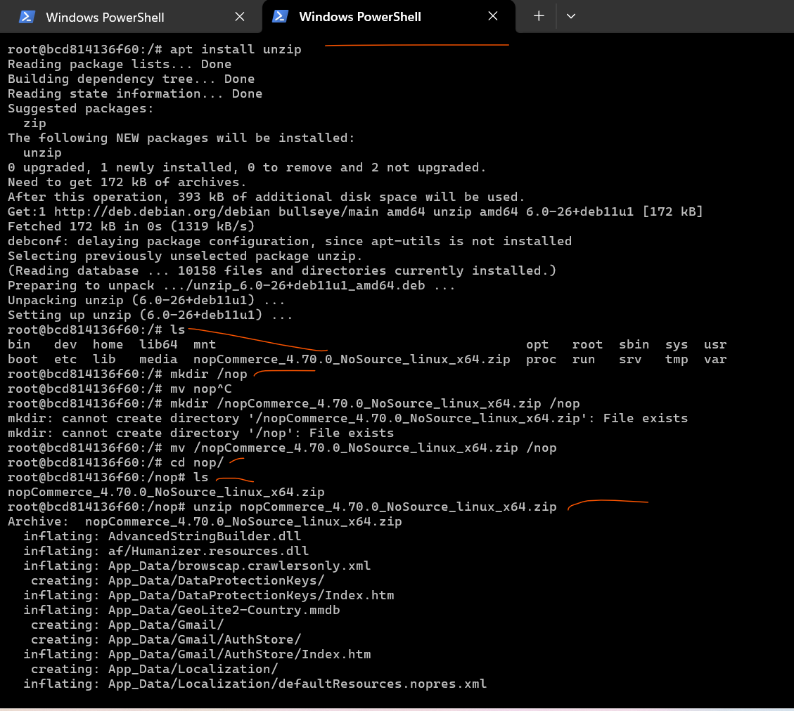
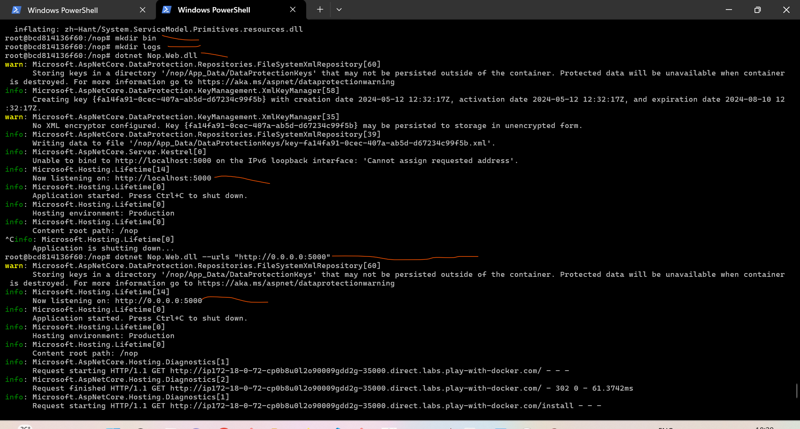
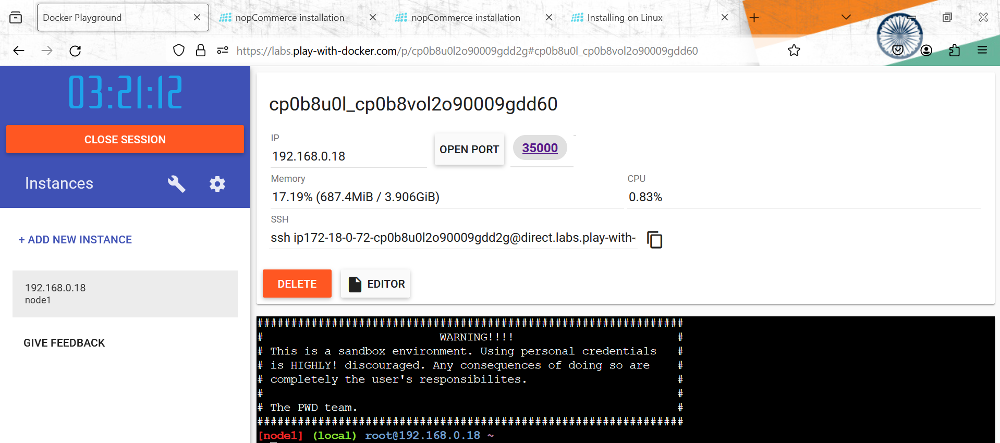
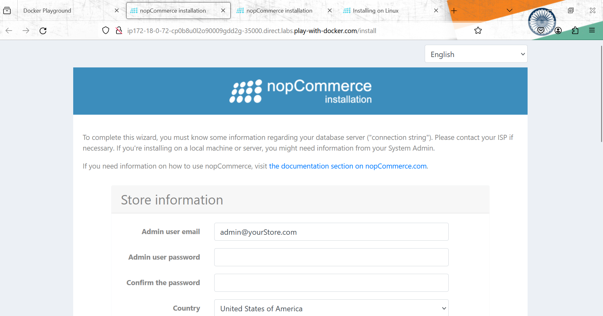
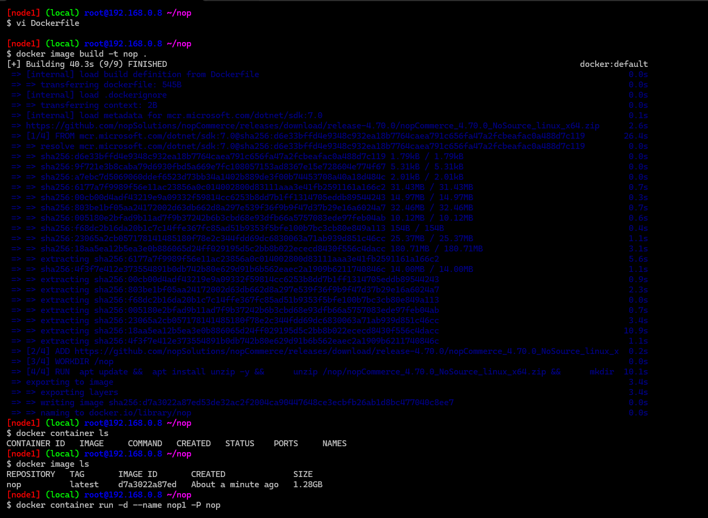
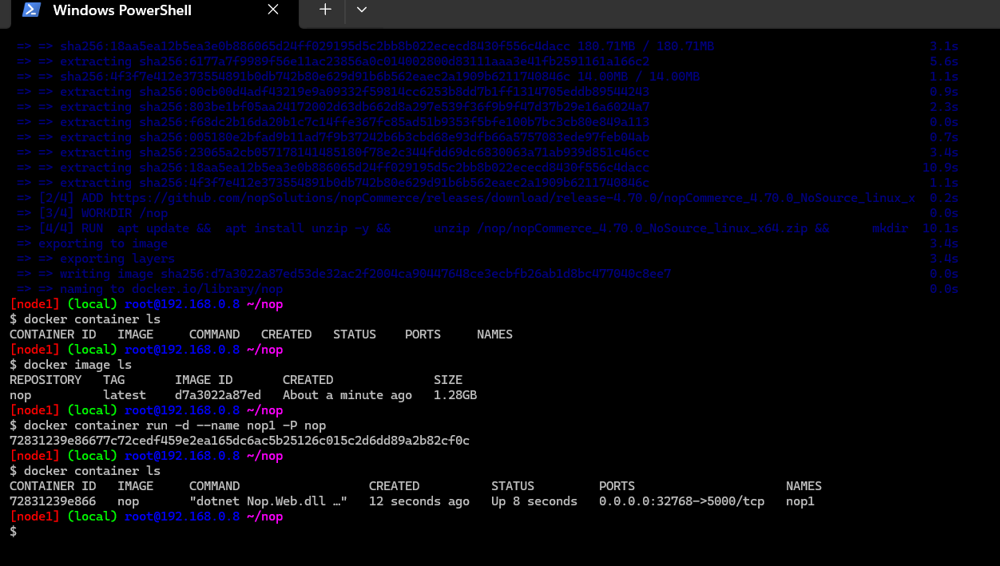
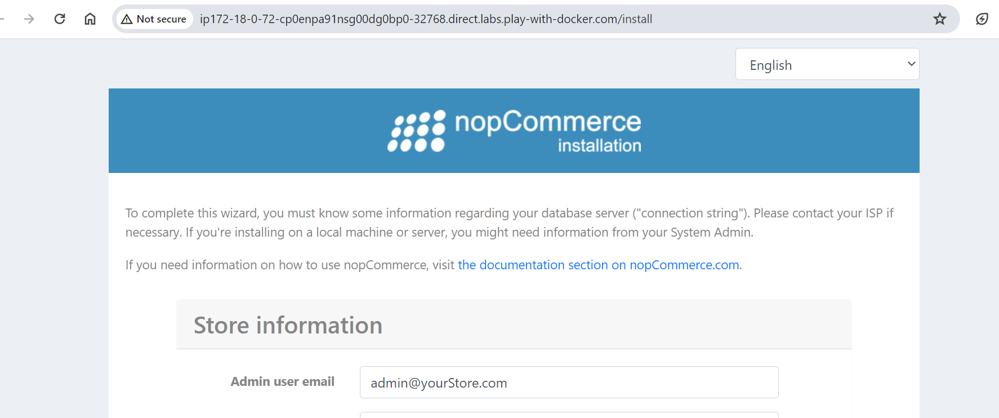
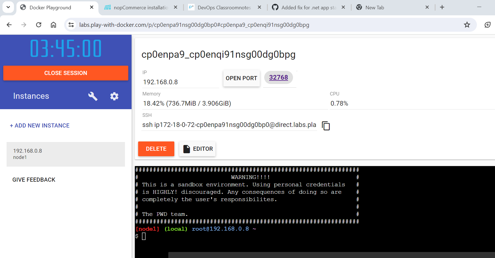

## Activity



## docker compose file reference search on google

* Containerize nop commerce
* link: https://docs.nopcommerce.com/en/installation-and-upgrading/installing-nopcommerce/installing-on-linux.html

* Manuall steps
* 1] take docker machine 
* create a container run in intractive mode 
` docker container run -it -p 35000:5000 mcr.microsoft.com/dotnet/sdk:7.0 /bin/bash`
* then download the file via 
```
wget wget https://github.com/nopSolutions/nopCommerce/releases/download/release-4.70.0/nopCommerce_4.70.0_NoSource_linux_x64.zip
apt update
apt install unzip
ls
mkdir /nop
mv nopCommerce_4.70.0_NoSource_linux_x64.zip /nop
ls
unzip nopCommerce_4.70.0_NoSource_linux_x64.zip
mkdir bin
mkdir logs
dotnet Nop.Web.dll
## its not showing on web for that we have to do lo to eth0 
## link: https://andrewlock.net/5-ways-to-set-the-urls-for-an-aspnetcore-app/
 dotnet Nop.Web.dll --urls "http://0.0.0.0:5000"

```





* Dockerfile
```
FROM mcr.microsoft.com/dotnet/sdk:7.0
LABEL author="anil" organization="qt" project="learning"
ADD https://github.com/nopSolutions/nopCommerce/releases/download/release-4.70.0/nopCommerce_4.70.0_NoSource_linux_x64.zip /nop/nopCommerce_4.70.0_NoSource_linux_x64.zip
WORKDIR /nop 
RUN  apt update &&  apt install unzip -y && \
     unzip /nop/nopCommerce_4.70.0_NoSource_linux_x64.zip && \  
     mkdir /nop/bin && mkdir /nop/logs
EXPOSE 5000
CMD [ "dotnet", "Nop.Web.dll", "--urls", "http://0.0.0.0:5000" ]
```






* Run these using commands
* create a docker compose file
* lets create nop-net bridge network
`docker network create --driver bridge nop-net`

* Lets create a nop-db volume
`docker volume create nop-db`

* Lets start by creating mysql container
```
docker container run --name mysql --network nop-net \
-e MYSQL_ROOT_PASSWORD=rootroot \
    -e MYSQL_USER=nop \
    -e MYSQL_PASSWORD=rootroot \
    -v nop-db:/var/lib/mysql \
    mysql:8
```
* __or__ we don't want to expose outside the world that's why we are not port forwaring outside the world in mysql. `-P` is Port forwarding symbol. 
`docker container run --name mysql --network nop-net -d -e MYSQL_ROOT_PASSWORD=rootroot -e MYSQL_USER=nop -e MYSQL_PASSWORD=rootroot -v nop-db:/var/lib/mysql mysql:8`


* Now build the nop image using Dockerfile

```
FROM mcr.microsoft.com/dotnet/sdk:7.0
LABEL author="anil" organization="qt" project="learning"
ARG user=nopcommerce
ARG group=nopcommerce
ARG uid=1000 
ARG gid=1000
ARG DOWNLOAD_URL=https://github.com/nopSolutions/nopCommerce/releases/download/release-4.60.2/nopCommerce_4.60.2_NoSource_linux_x64.zip
ARG HOME_DIR=/nop
RUN apt update && apt install unzip -y
# Create user nopcommerce
RUN groupadd -g ${gid} ${group} \
    && useradd -d "$HOME_DIR" -u ${uid} -g ${gid} -m -s /bin/bash ${user}
USER ${user}
WORKDIR ${HOME_DIR}
ADD --chown=${user}:${group} ${DOWNLOAD_URL} ${HOME_DIR}/nopCommerce_4.60.2_NoSource_linux_x64.zip
RUN unzip ${HOME_DIR}/nopCommerce_4.60.2_NoSource_linux_x64.zip && \
    mkdir ${HOME_DIR}/bin && mkdir ${HOME_DIR}/logs
EXPOSE 5000
ENV ASPNETCORE_URLS="http://0.0.0.0:5000"
CMD [ "dotnet", "Nop.Web.dll"]

```

* Now run the nop container
`docker container run --name nop --network nop-net -P -d nop:4.60.2`
* In the install page, pass connection string
`server=mysql;uid=root;pwd=rootroot;database=nop`
* Doing the same as above using compose file.
```
---
version: "3.9"
services:
  nop:
    build:
      context: .
      dockerfile: Dockerfile
    networks:
      - nop-net
    ports:
      - "35000:5000"
    depends_on:
      - nop-db

  nop-db:
    image: mysql:8
    networks:
      - nop-net
    volumes:
      - nop-db:/var/lib/mysql
    environment:
      - MYSQL_ROOT_PASSWORD=rootroot
      - MYSQL_USER=nop
      - MYSQL_PASSWORD=rootroot
      - MYSQL_DATABASE=nop
volumes:
  nop-db:
networks:
  nop-net:
```
* ## Always try to do work from `least dependent system to most dependent system`
* = least depentent is basically which the system dosen't have  any denpendence on.  like `mysql` doesn't need nop application to run . But Nop application requires `mysql` to run . So Nop has dependence on mysql and mysql does't have dependence on any thing, that is what least denpencence to most dependence.
* ## how to check the logs of containers and how to put the restrictions on containers cpu ?
-------------------------------------------------------------------------------------------------------------------


