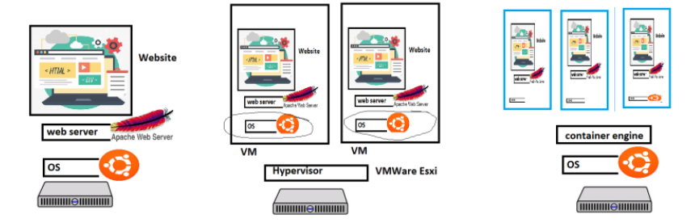
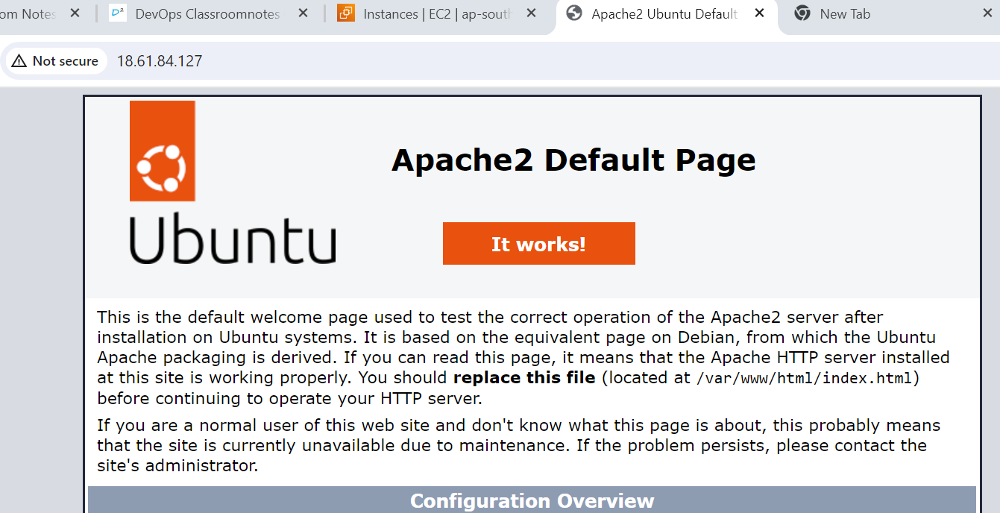
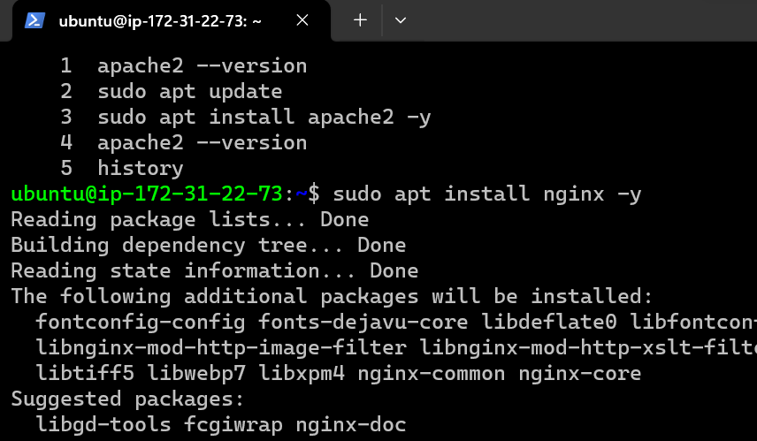
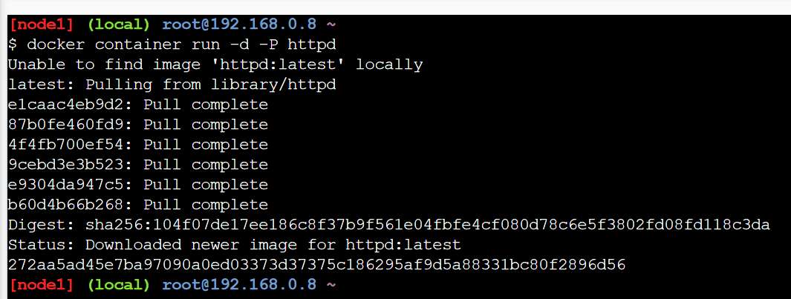
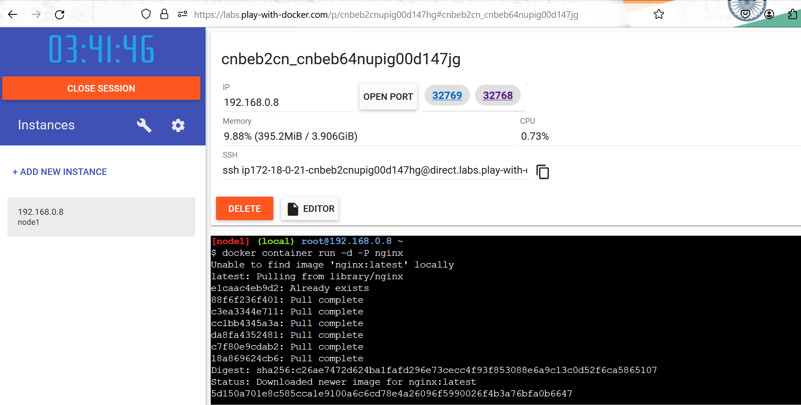
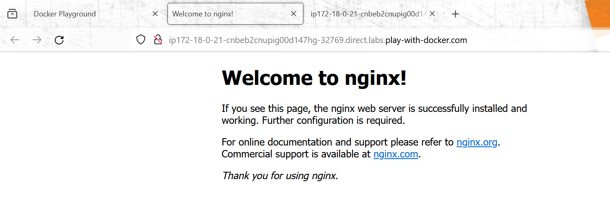

##            Docker 2            

## Application Deployments

__Terms__:

* Capex: Captial Expenditure = this refer to the organisation done purchasing servers
* Opex: Operational Expenditure = which your organisation does to maintain servers 
* Physical Server
* Hypervisor = hypervisor is a software that is use to create virtual machines 
       * There are 2 types of Hypervisor 
          * 1 which you directly install on physical server and then create a vm
          * 2nd is which you install top of the operating system to create vm 
* Virtual Machine
* Return on Investment (ROI)

__Evolution__

* Generation 1: 
       * Directly run on Physical Servers
       * If your application is not utilizing hardware completely, ROI is very long

* Generation 2: 
       *  Hypervisors create virtual machines and applications installed in virtual machines

* Hypervisors perform hardware virtualizationa and provide
       * virtual cpu
       * virtual disk
       * virtual ram
       * virtual network

* In the isolated area created by hypervisor, we can install os and necessary softwares
* Application can be installed and used from here
* Better ROI

* Generation 3:
       * Containers: These are isolated areas which look like vms but the container is an isolated area which has virtualized os.
       * Applications running in Containers will not feel the difference
       * We can run more applications on a single box

## What is docker?

* Docker (dock worker) is used to create containers which is standard way of packaging any application

* Application can be any of the below but have a standard way of packaging i.e docker image
       * developed in any technology
       * develop in any server

* Packaging in docker image format helps us to run our application 

## Expectations from you in terms of Docker

* Containerize any application run by your organization.
* Manage Data, Security and Networks for containerized applications.
* To acheive the above expectations, we need to use
       * docker can understand how it runs and creates containers
       * play with docker aroud networks, data and security
       * apply them to our application. 

## Run apache server (VM)

* Create a vm (ubuntu) and ssh into it

``sudo apt update`` 
``sudo apt install apache2 -y ``

* Now navigate to `http://<publicip>`

* I have install 1st apache2 in vm then nginx both are woek on 80 ports so apache2 is show webpage but not nginx coz at 1 vm only 1st one is work but when the name do __Docker__ come in docker container both will work.

* so now we are trying torun in docker play (container) we install httpd=apache2 and ngnix both are working in it.
coz on physical machine we have install os like ubuntu etc on above of ubuntu we have container engine is nothing but it is docker installed and that docker create isolated area where we can run many applications , we can run 3 jenkins machine on a same server or different versions of any application on it.

* __container is very lightweight and portaible__ 
* __when we package our Application in the container format so we can run our application anywhere that,s the reasion its a portable and they will be extremly lightweight__

-------------------------------------------------------------------------------------------------------------------

