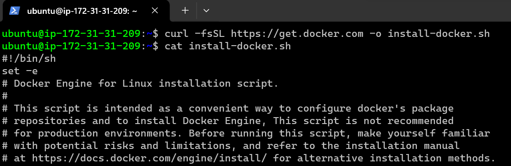

## Docker 3

## Docker Installation

* When we install docker we get two major components
      * docker client:
          * A command line to interact with docker engine
      
      * docker engine: 
          * This is collection of multiple components 
          * Orchestration
          * Docker daemon
          * Runtime

* to play with docker commands
     * manual --help
     * cheatsheet

* install 
    * Linux VM:
    * Docker can be installed by following instructions over here: https://docs.docker.com/engine/install/
    * script based installation: https://get.docker.com/
    `curl -fsSL https://get.docker.com -o install-docker.sh`
    `sudo sh install-docker.sh`

* Docker allows communication to the unix socket for the users who belong to docker group. so lets add current user to docker group `sudo usermod -aG docker <username>`. 
*  logout and login

* Now execute `docker container run hello-world`

## Windows 10/11 (Non Home editions)
* refer: https://docs.docker.com/desktop/install/windows-install/
* I will not recommend installing docker on windows.

## Mac

* refer: https://docs.docker.com/desktop/install/mac-install/

## Docker Playground

* create a docker hub account : https://hub.docker.com/
* This playground gives a linux machine with docker installed for 4 hours for free.
  
## terms To be aware of

`containerd`

`runc`

`libcontainer`

`oci`

`docker shim`

`appc`

`grpc`

`rkt containers`

## cheatsheet

* refer: https://docs.docker.com/get-started/docker_cheatsheet.pdf

* refer: https://dockerlabs.collabnix.com/docker/cheatsheet/

## 

