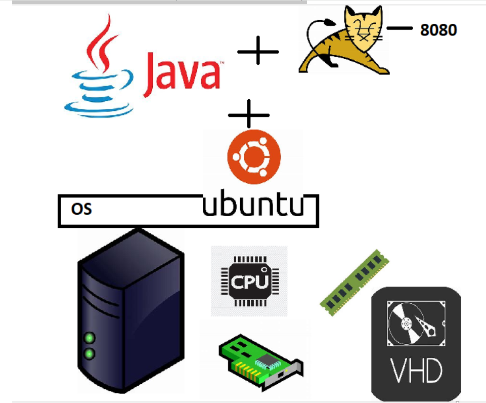

## Docker 4

* Applications bring revenue to enterprises and to run applications we need servers, os etc

* __Lets create a linux server and install tomcat in it__

* Create a linux server (AWS/Azure/GCP)



* We have experimented in the linux vm
* network interface gives network connectivity
* cpu, ram and disk are available
* to install softwares we have used package manager apt

## command

```
sudo apt update
sudo apt install net-tools 
sudo apt-cache search openjdk
sudo apt install openjdk-11-jdk 
java --version
sudo apt-cache search tomcat 0r tomcat9
tomcat --version
to check tomcat 
sudo systemctl status tomcat 

``` 


* Dockerplayground 
* for full screen docker's terminal use key `Alt+Enter and same for small`
* and you can use this to in your windows terminal 
* ssh ip172-18-0-45-cnc35o47vdo000fmvogg@direct.labs.play-with-docker.com
* copy above  from ssh to .com and paste it on windows terminal it will work.
* 

* __We were able to exactly the similar operations inside container as well.__.

## Let me take a application

* This is spring pet clinic application
* Lets try to run this application on linux. 
* refer: https://github.com/spring-projects/spring-petclinic.git
* To build the code

```
sudo apt update
sudo apt install openjdk-17-jdk -y
sudo apt install maven -y 
git clone https://github.com/spring-projects/spring-petclinic.git
cd spring-petclinic
# java package 
mvn package 
java -jar target/spring-petclinic-3.2.0-SNAPSHOT.jar

```

* this is the application which we have build 


* how the application look like and this how you run the application `java -jar target/spring-petclinic-3.2.0-SNAPSHOT.jar`

* Docker way of working
    * We create a docker image (docker packaging format)
        * We need to create Dockerfile
        * push the image to registry (docker hub)
        * create the container using the image anywhere

* Dockerfile

```
FROM amazoncorretto:17-alpine-jdk
Label author=anil
ADD target/spring-petclinic-3.2.0-SNAPSHOT.jar /springpetclinic.jar
EXPOSE 8080
CMD ["java", "-jar", "/springpetclinic.jar" ]

```   

## Create docker image

`docker image build -t spc:3.2.0 .`


## to create container

```
docker container run -d -p 8081:8080 spc:3.2.0
docker container run -d -p 8082:8080 spc:3.2.0
docker container run -d -p 8083:8080 spc:3.2.0

```
This containers are isolated from each others


## Next Steps

* How is container able to give ip address/storage/process/cpu/ram etc
* Container architectures (3 versions)
* understanding image and container
* docker container life cycle
* containerization
* networking , storage aspects
  

##


