##              Docker

## Docker container lifecycle

* Docker lifecycle states 
    * Created
    * Running
    * Paused
    * Stopped
    * Deleted
* 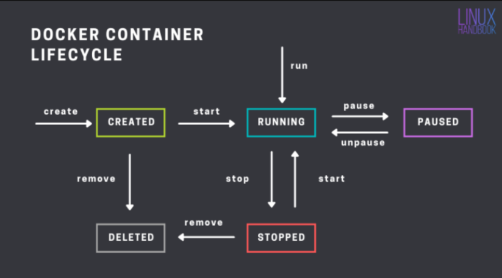
* Accessing the applications inside docker containers
* From now the machine where we have installed docker will referred as host and the docker container will be referred as container
* We have access to host network & as of now containers are created in private container network, so to access applications inside containers we use port-forwording
* 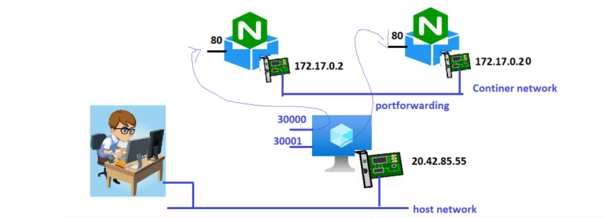

* __Port forwarding Command:__
* `docker conatiner run -d -p <host-port>:<container-port> <image>`

* Create a nginx container and expose on port 30000 
* `docker container run -d -p 3000:80 --name nginx1 nginx `

* 

* Create a jenkins container & expose 8080 port on 30001 port of host
* `docker container run -d -p 30001:8080 --name jenkis1 jenkins/jenkins`

* 

* To assing any random free port on host to container port
* `docker container run -d -p image`

* Lets create 3 nginx containers 
* `docker container run -d --name nginx1 -P nginx`
* `docker container run -d --name nginx2 -P nginx`
* `docker container run -d --name nginx3 -P nginx`
* 

## Exercise

* install docker on a linux vm
* `docker container run -d --name apache -P htppd`
* 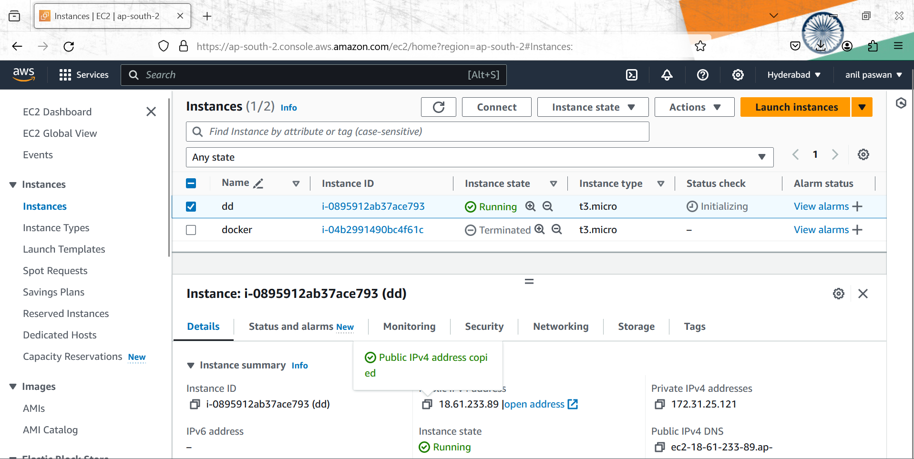
* Run 1 httpd containers (apache container) which runs on 80 port
* __`docker container inspect (container name/container id)` it will give you ip address of container__.
* 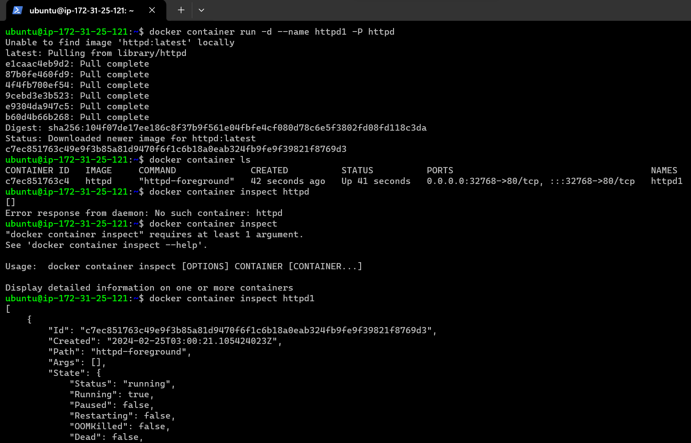
* try accessing any application
* 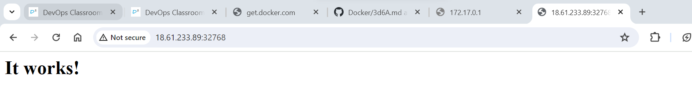
* stop the containers and try accessing
* 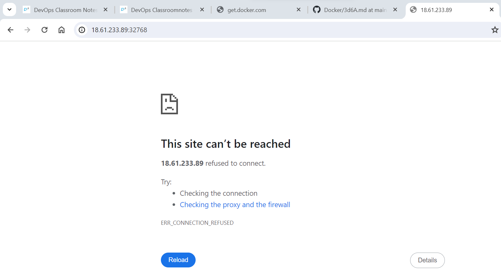 
  __during stop condition container is not accessable__ 
* start the containers and access this should work
* __when you start the container after stoping its change the port no. , like before stop the container i have port no. `32768` after stop and again start its show its port no. `32769`__
* 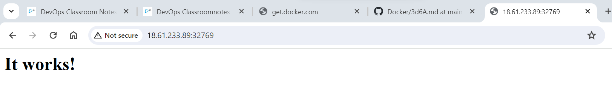
* pause the containers, access the application
* `docker container pause httpd`
* 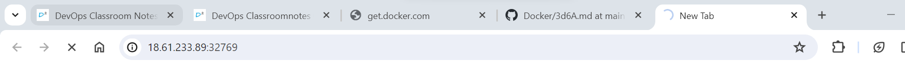
* 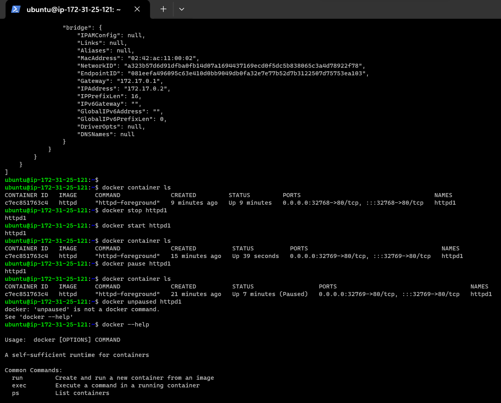
* unpause the containers, access the application 
* __while pause and unpause container will not change its port no. its chnges only when you stop or start the container__
* 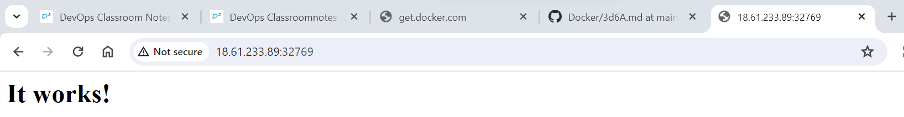
* 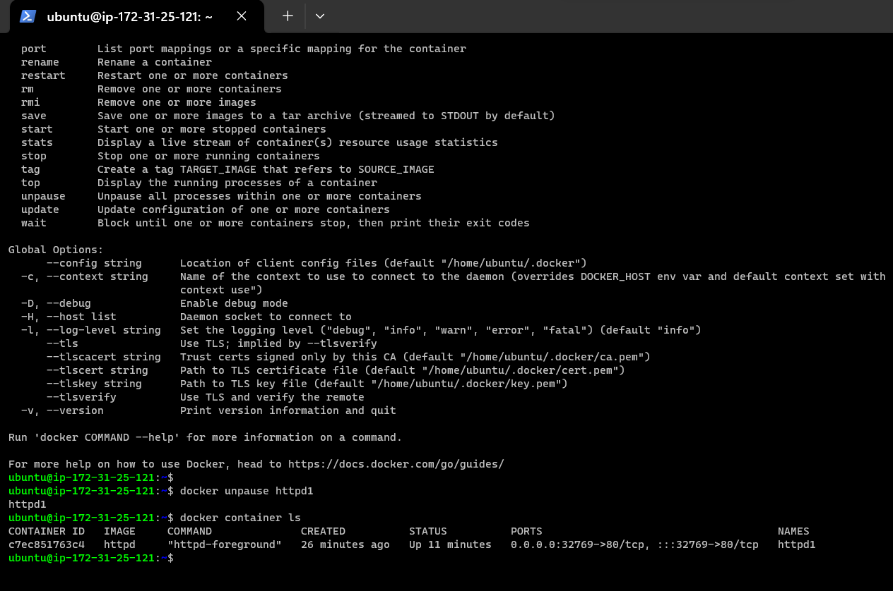
* delete the container 
* 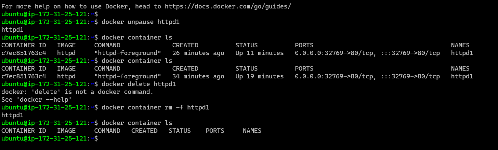
* `docker container rm -f httpd1`
* All used command's history
* 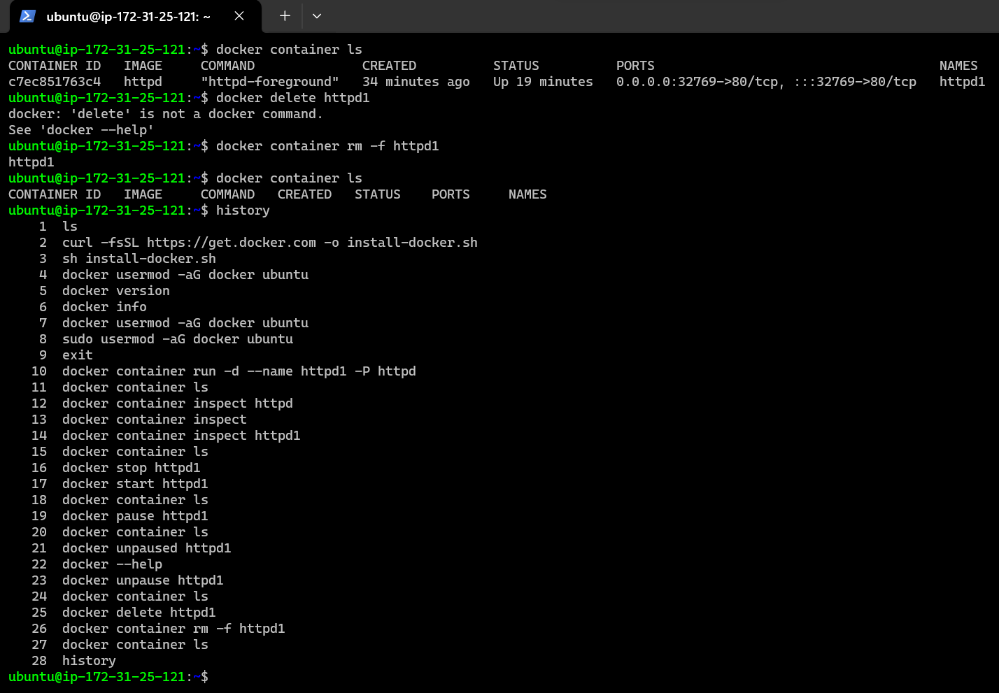 
* __we have given 65000/65k free ports__
* __In docker when we use small p `-p` in that we have to give port no. but when we use capital P `-P` it will take automatically port no.__
* create a container of nginx or jenkins and give manually port no. and try to accessing on server 
* 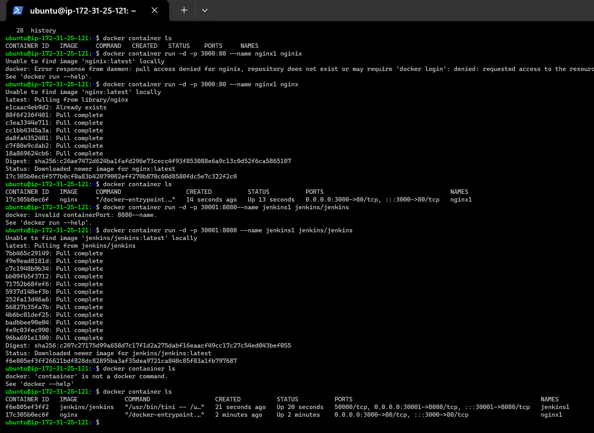
* 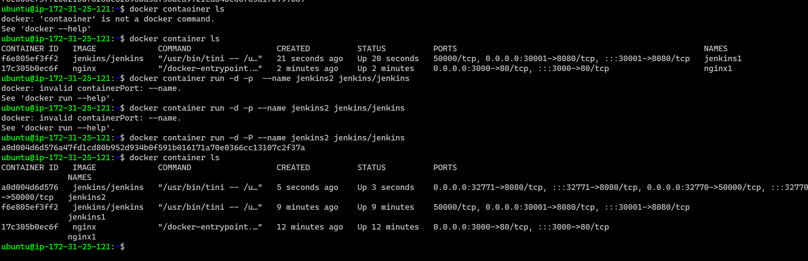
* Nginx
* 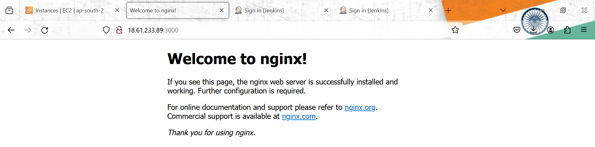
* Jenkins1
* 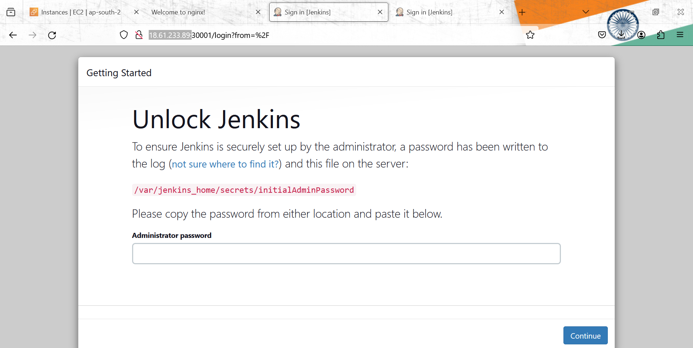
* Jenkins using capital `-P` it takes automatically port no. or id.   
* 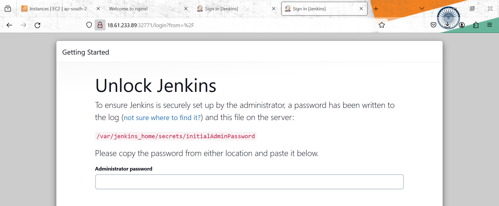
* 

## Containerizing spring petclinic

* I have spring petclinic version 2.4.2 which requires java 11 and runs on port 8080 
* to start application `java -jar spring-petclinic-2.4.2.jar`
* What is required: 
   * openjdk-11-jdk
   * jar file 
* How to access application
   * http over port 8080

* Lets start the amazoncorretoo based container with port 8080 exposed
* refer: https://hub.docker.com/_/amazoncorretto
* `docker container run -it -p 30000:8080 amazoncorretto:11 /bin/bash`
* 

## now lets download the spring petclinic
* refer: https://github.com/spring-projects/spring-petclinic.git
* 
  