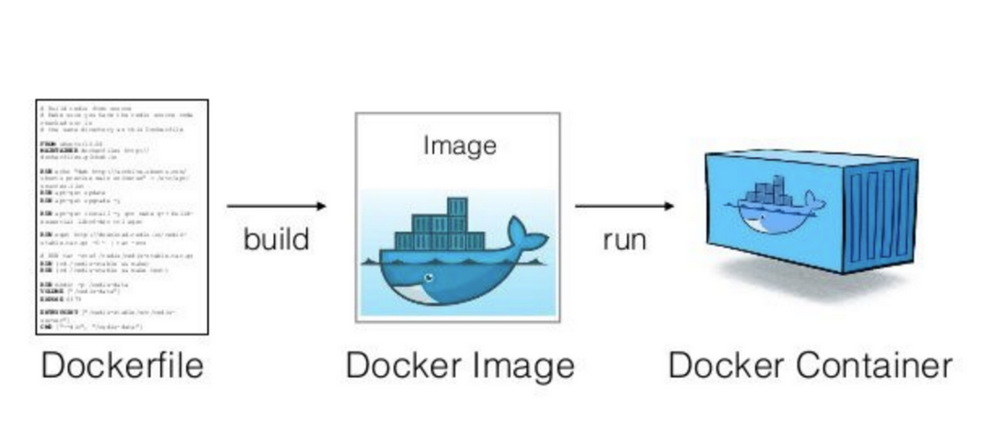
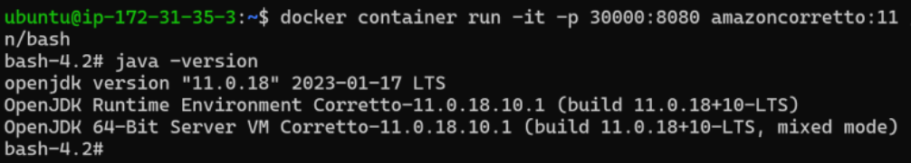
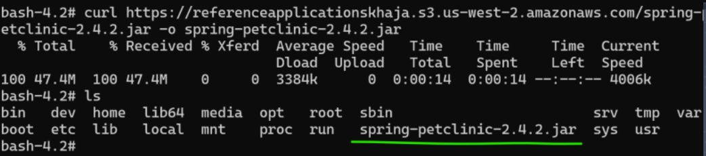
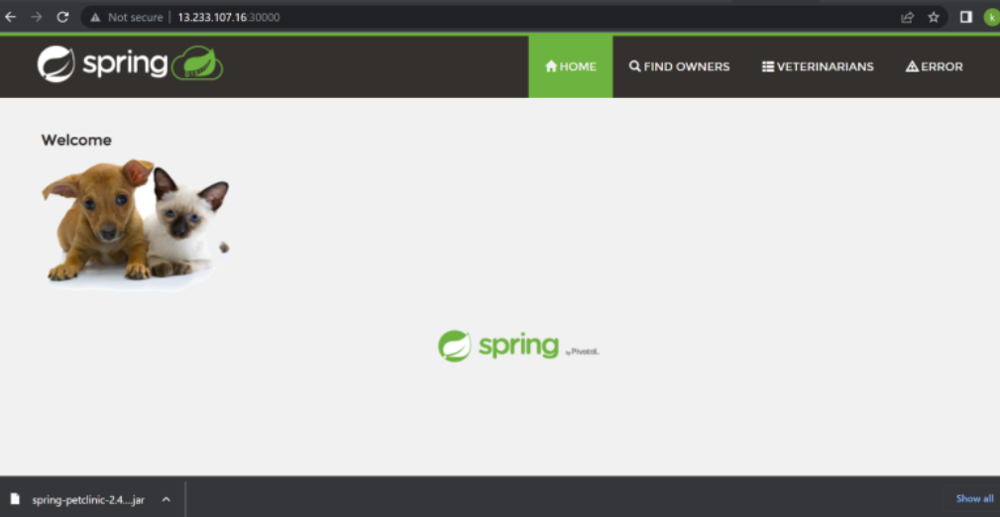
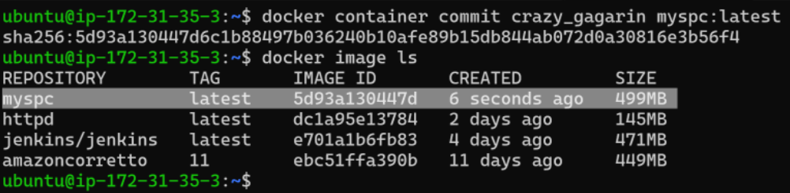
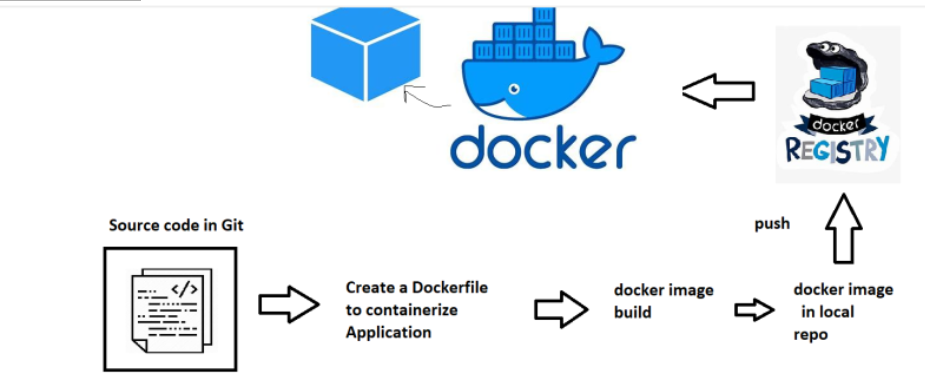
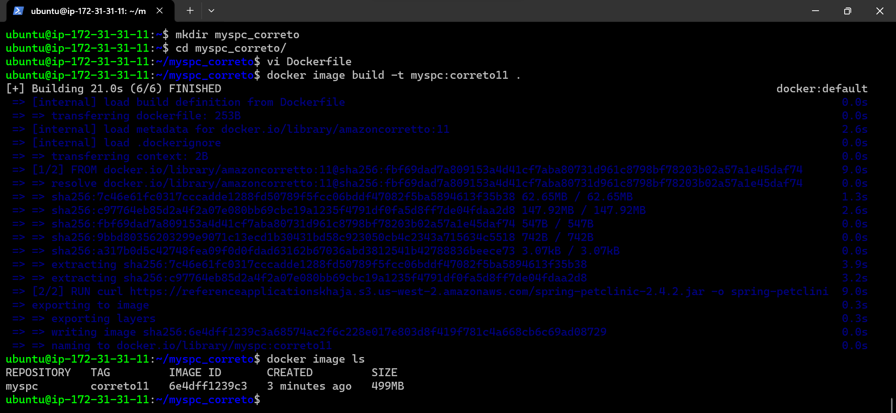
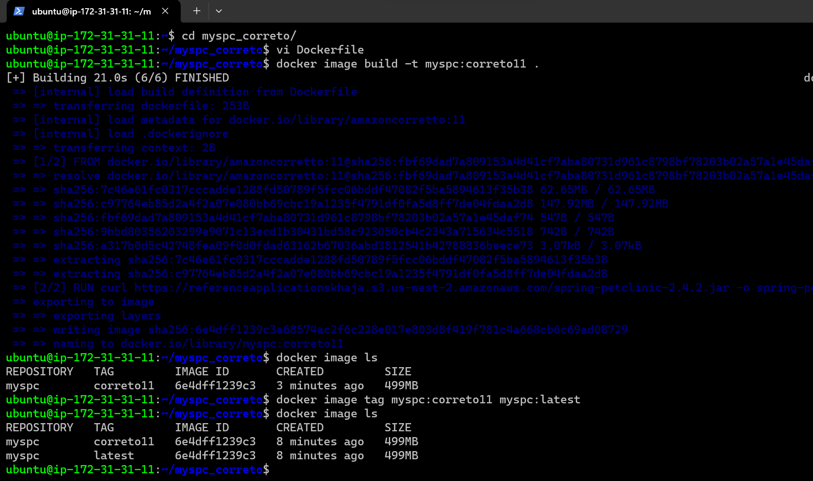

##                                   Docker

* ## Differences Between a DockerFile, Docker Image, and Docker Container
* 
  
## Docker container lifecycle 

* Docker lifecycle states 
    * Created
    * Running
    * Paused
    * Stopped
    * Deleted
* 
* Accessing the applications inside docker containers
* From now the machine where we have installed docker will referred as host and the docker container will be referred as container
* We have access to host network & as of now containers are created in private container network, so to access applications inside containers we use port-forwording
* 

* __Port forwarding Command:__
* `docker conatiner run -d -p <host-port>:<container-port> <image>`

* Create a nginx container and expose on port 30000 
* `docker container run -d -p 3000:80 --name nginx1 nginx `

* 

* Create a jenkins container & expose 8080 port on 30001 port of host
* `docker container run -d -p 30001:8080 --name jenkis1 jenkins/jenkins`

* 

* To assing any random free port on host to container port
* `docker container run -d -p image`

* Lets create 3 nginx containers 
* `docker container run -d --name nginx1 -P nginx`
* `docker container run -d --name nginx2 -P nginx`
* `docker container run -d --name nginx3 -P nginx`
* 

## Exercise

* install docker on a linux vm
* `docker container run -d --name apache -P htppd`
* 
* Run 1 httpd containers (apache container) which runs on 80 port
* __`docker container inspect (container name/container id)` it will give you ip address of container__.
* 
* try accessing any application
* 
* stop the containers and try accessing
*  
  __during stop condition container is not accessable__ 
* start the containers and access this should work
* __when you start the container after stoping its change the port no. , like before stop the container i have port no. `32768` after stop and again start its show its port no. `32769`__
* 
* pause the containers, access the application
* `docker container pause httpd`
* 
* 
* unpause the containers, access the application 
* __while pause and unpause container will not change its port no. its chnges only when you stop or start the container__
* 
* 
* delete the container 
* 
* `docker container rm -f httpd1`
* All used command's history
*  
* __we have given 65000/65k free ports__
* __In docker when we use small p `-p` in that we have to give port no. but when we use capital P `-P` it will take automatically port no.__
* create a container of nginx or jenkins and give manually port no. and try to accessing on server 
* 
* 
* Nginx
* 
* Jenkins1
* 
* Jenkins using capital `-P` it takes automatically port no. or id.   
* 
* 

## Containerizing spring petclinic

* I have spring petclinic version 2.4.2 which requires java 11 and runs on port 8080 
* to start application `java -jar spring-petclinic-2.4.2.jar`
* What is required: 
   * openjdk-11-jdk
   * jar file 
* How to access application
   * http over port 8080

* Lets start the amazoncorretoo based container with port 8080 exposed
* refer: https://hub.docker.com/_/amazoncorretto
* `docker container run -it -p 30000:8080 amazoncorretto:11 /bin/bash`
* 

## now lets download the spring petclinic

* refer: https://github.com/spring-projects/spring-petclinic.git

* `curl https://referenceapplicationskhaja.s3.us-west-2.amazonaws.com/spring-petclinic-2.4.2.jar -o spring-petclinic-2.4.2.jar
ls`

* 
* Run the application `java -jar spring-petclinic-2.4.2.jar`
* 
*  Now to create a image from a running container, lets login into linux vm, so lets use  `docker container commit`
* 
* remove all the containers and run the myspc image based container
* `docker container run -d -p 30001:8080 --name spc1 myspc:latest java -jar spring-petclinic-2.4.2.jar`

* This is not a useful approach as we are creating images manually
* DOcker has a better way i.e. `Dockerfile`

* ## Dockerfile based Image building
* Workflow
* 
* Dockerfile is a text file with instructions Refer Here: https://docs.docker.com/reference/dockerfile/ 
* The basic syntax `INSTRUCTION arguments`
* In Docker we have concept of base image i.e. to run your application using some existing image
* We can use a base image called as scratch which has nothing in it
* In majority of the cases we take what is required to run our application as base image.
* ## Basic Instructions
* FROM: Refer Here:https://docs.docker.com/reference/dockerfile/#from for official docs. use tag all the time (donot use latest). `its speaks about running the base image`
* RUN: The commands to be executed while building the image to install/configure your appliation Refer Here:https://docs.docker.com/reference/dockerfile/#run . `RUN = its speaks about executing the command while building the image`
* CMD: This command will be executed while starting the container. Refer Here for official docs: https://docs.docker.com/reference/dockerfile/#cmd . `this command is used when the docker container start and docker container run or its speaks about what is the command that it should run which start your application during container creation and container starts.` 
* EXPOSE: This adds ports to be exposed while starting the container Refer Here for official docs: https://docs.docker.com/reference/dockerfile/#expose
  
* The Dockerfile supports the following instructions:
* ## Instruction	Description
* `ADD`	Add local or remote files and directories.
* `ARG`	Use build-time variables.
* `CMD`	Specify default commands.
* `COPY`	Copy files and directories.
* `ENTRYPOINT`	Specify default executable.
* `ENV`	Set environment variables.
* `EXPOSE`	Describe which ports your application is listening on.
* `FROM`	Create a new build stage from a base image.
* `HEALTHCHECK`	Check a container's health on startup.
* `LABEL`	Add metadata to an image.
* `MAINTAINER`	Specify the author of an image.
* `ONBUILD`	Specify instructions for when the image is used in a build.
* `RUN`	Execute build commands.
* `SHELL`	Set the default shell of an image.
* `STOPSIGNAL`	Specify the system call signal for exiting a container.
* `USER`	Set user and group ID.
* `VOLUME`	Create volume mounts.
* `WORKDIR`	Change working directory.

## Springpetclinic Dockerfile

* 1st create vm . 
* in vm install docker via docker script install
* `curl -fsSL https://get.docker.com -o install-docker.sh`
* `sh install-docker.sh`
* add user group to docker `sudo usermod -aG docker ubuntu`
* Lets do two ways 
   * use any image with java11 already as base image `amazoncorretto:11`
   * use any image with slim os as base image `alpine:3`
* Dockerfile- based on amazoncorreto:11 

```
FROM amazoncorretto:11
RUN curl https://referenceapplicationskhaja.s3.us-west-2.amazonaws.com/spring-petclinic-2.4.2.jar -o spring-petclinic-2.4.2.jar
EXPOSE 8080
CMD ["java", "-jar", "spring-petclinic-2.4.2.jar"]

```
* Lets build the image based on amazoncorreto
* 
* ## if you want to give latest version tag to your older image so you should do this
* 
* 