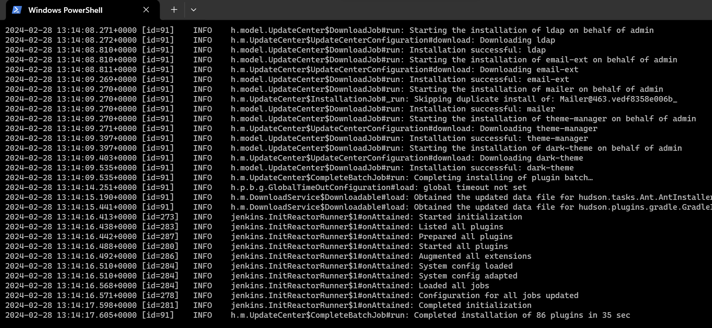

##                          Docker 

## Dockerfile Instructions Contd…

* LABEL: This instruction adds metadata. Refer here: https://docs.docker.com/reference/dockerfile/#label
## using commands till now 
* 
* in this Dockerfile we are using `RUN` command for downloading link and after `RUN` command we used `curl or sometime wget`
  
```
FROM amazoncorretto:11
LABEL author="Anil"
LABEL docker="learning"
LABEL organization="qt"
RUN curl https://referenceapplicationskhaja.s3.us-west-2.amazonaws.com/spring-petclinic-2.4.2.jar -o spring-petclinic-2.4.2.jar
EXPOSE 8080
CMD ["java", "-jar", "spring-petclinic-2.4.2.jar"]

```
* Lets inspect the image docker image inspect spc1 and observe the labels section
* 

## now we are going to use `ADD OR COPY` command instead of using `wget or curl` for download the link 

## ADD, COPY instructions

* ADD instruction can add the files into docker image from local file system as well as from http(s)
* ADD instruction can have sources 
    * local file system
    * git repo
    * url 
* COPY supports only local file system
* Lets use ADD to download springpetclinic into docker image from url: `ADD https://referenceapplicationskhaja.s3.us-west-2.amazonaws.com/spring-petclinic-2.4.2.jar /spring-petclinic-2.4.2.jar`
* 

```
FROM amazoncorretto:11
LABEL author="anil"
LABEL docker="learning"
LABEL organization="qt"
ADD https://referenceapplicationskhaja.s3.us-west-2.amazonaws.com/spring-petclinic-2.4.2.jar /spring-petclinic-2.4.2.jar
EXPOSE 8080
CMD ["java", "-jar", "/spring-petclinic-2.4.2.jar"] 

```
! [preview](images/106.png)

* copy the springpetclinic jar file into some local path on docker host.
* 
* 
  
```
FROM amazoncorretto:11
LABEL author="anil"
LABEL docker="learning"
LABEL organization="qt"
COPY /spring-petclinic-2.4.2.jar /spring-petclinic-2.4.2.jar
EXPOSE 8080
CMD ["java", "-jar", "/spring-petclinic-2.4.2.jar"]

```

* ### What do we mean by running container in detached mode?
* Lets try to start the docker container jenkins `jenkins/jenkins`
* `docker container run -P jenkins/jenkins`
* when we use don't use -d (diatach) mode then it will show you all logs on terminal give below picture..\
* 
* 
* 
* to come out from this log you have to enter `ctrl+c` after that the web page is stop working
* 
* docker container’s STDOUT and STDERR will be attached to your terminal and if we execute ctrl+c the container exits.
* Running container normally will take us to attached mode.
* __In detached mode container executes and gives us back the access to terminal__
* 
* Once we start the container in detached mode we can still view the STDOUT and STDERR by executing
* * 
* `docker container attach <container-name-or-id>`
* To exit from attach mode `Ctrl+PQ`
* ## Running containers in a background is called Detached Mode
## Docker container will be in running state as long as command in cmd is running

* Consider the following Dockerfile

```
FROM amazoncorretto:11
LABEL author="anil"
LABEL organization="qt"
LABEL docker="learning"
# Copy from local file on Docker host into docker image
COPY spring-petclinic-2.4.2.jar  /spring-petclinic-2.4.2.jar
EXPOSE 8080
CMD ["sleep", "10s"]

```
* We have sleep 10s i.e. this will run for 10s and finish.

* Docker container will move to exited stated once the command in CMD has finished executing

## This is 3rd mode when you inside the container.
* 
* 
* create systemd service file: https://www.shellhacks.com/systemd-service-file-example/
* 

## Exercise:
  
   * Create a ubuntu vm
   * install apache2 and note the ExecStart command for apache2
   * install tomcat9 and note the ExecStart command for tomcat9
   * stop the services (systemcl stop servicename)
   * become a root user (sudo -i)
   * try executing the ExecStart command directly and see if the application is running.

