## Docker 

* ## .net application manual process 
* we use manually commands to run inside the container `-it = intractive mode ` 
* `docker container run -it -d -p 36000:5000 mcr.microsoft.com/dotnet/sdk:7.0 /bin/bash`
* `apt update` ,
* `apt install unzip -y` , 
* `wget  https://github.com/nopSolutions/nopCommerce/releases/download/release-4.60.6/nopCommerce_4.60.6_NoSource_linux_x64.zip`
* `mkdir /nop` , 
* `mv nopCommerce_4.60.6_NoSource_linux_x64.zip /nop`
* `cd nop` 
* `unzip /nopCommerce_4.60.6_NoSource_linux_x64.zip`
* `mkdir bin logs`
* `dotnet Nop.Web.dll --urls "http://0.0.0.0:5000"`

* extra `dotnet Nop.Web.dll` 
* ## to expose dotnet use this docs `dotnet --urls "http://localhost:5100"`
* [Refer Here] `https://andrewlock.net/why-isnt-my-aspnetcore-app-in-docker-working/`
* 
* Refer Here for manual steps: https://docs.nopcommerce.com/en/installation-and-upgrading/installing-nopcommerce/installing-on-linux.html
* This application requires  
    * mysql server (lets ignore this)
    * .dotnet runtime 7.0
    * it runs on port 5000
* Steps: 
    * Ensure dotnet 7 is installed
    * Download application from :  wget https://github.com/nopSolutions/nopCommerce/releases/download/release-4.60.6/nopCommerce_4.60.6_NoSource_linux_x64.zip
    * unzip the application into some folder
    * create two directories bin and logs
    * refer: dotnet run on 0.0.0.0 refer: https://andrewlock.net/5-ways-to-set-the-urls-for-an-aspnetcore-app/
    * Run the application using command ` dotnet Nop.Web.dll --urls "http://0.0.0.0:5000"`
     
* 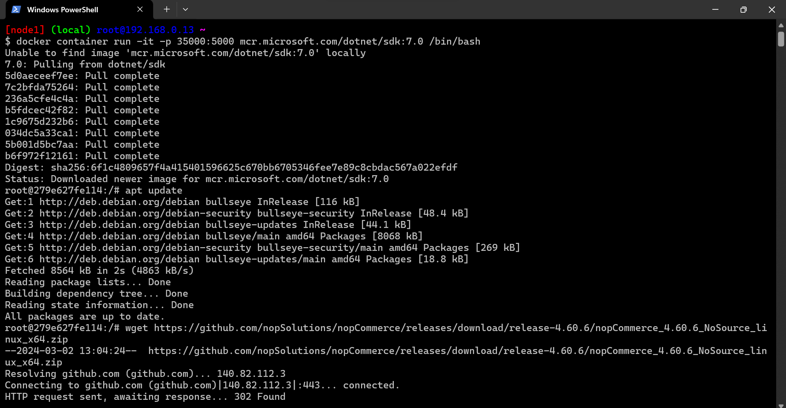
* refer: https://hub.docker.com/_/microsoft-dotnet-runtime 
* 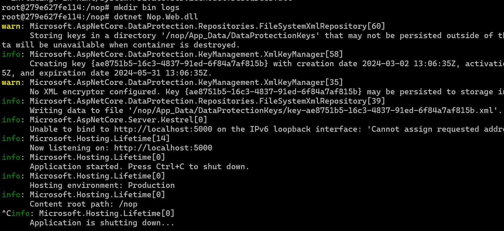 
* loopback basically is used for connectivity within your system
* eth0 or 1 ports they are basically available  for other connectivity form other system
* in this case web server is not responding due to (lo) loopback connection 
* 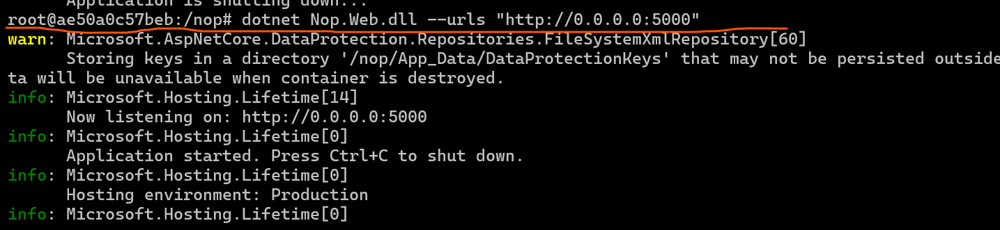
  
* ## This is 1 error you might seen most often in loopback then we  have to forward on `eth0 or eth1` for expose outside other system .
* 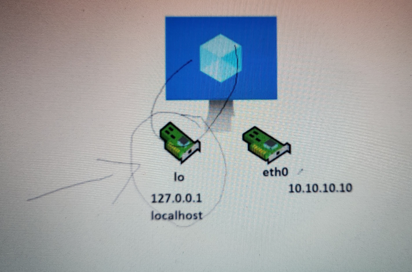
* 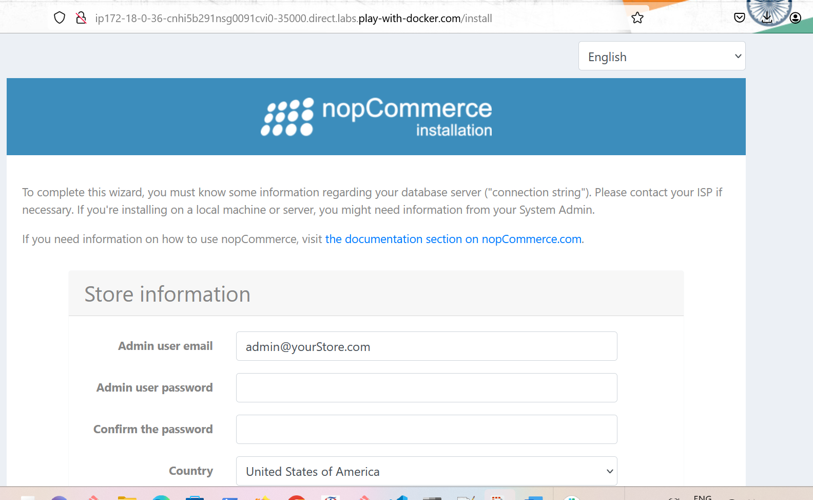
* 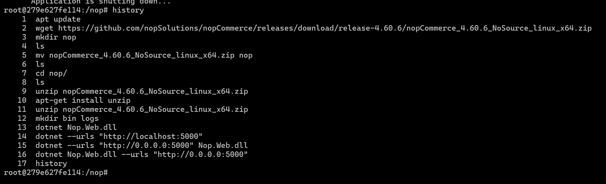  


 ## Dockerfile for .net application
 
 * for running inside the container `docker container run -it -P nop:v1:0.0 /bin/bash`
 * ## grep command `ls | grep Nop.web`
 * when something going wrong and not working so go `search it on google verbose mode for dotnet command` use command  `dotnet --urls http://0.0.0.0:5000 /nop/Nop.Web.dll --verbosity d or diag `
        * `dotnet Nop.Web.dll --urls http://0.0.0.0:5000 --verbosity diag `
 
## vi Dockerfile

```
FROM mcr.microsoft.com/dotnet/sdk:7.0
LABEL author="anil" learning="docker" organization="qt"
ADD https://github.com/nopSolutions/nopCommerce/releases/download/release-4.60.6/nopCommerce_4.60.6_NoSource_linux_x64.zip /nop/nopCommerce_4.60.6_NoSource_linux_x64.zip
WORKDIR /nop
RUN apt update && apt install unzip && \
    unzip /nop/nopCommerce_4.60.6_NoSource_linux_x64.zip && \
    mkdir /nop/bin && mkdir /nop/logs
EXPOSE 5000
CMD [ "dotnet", "Nop.Web.dll", "--urls", "http://0.0.0.0:5000" ]

```

* 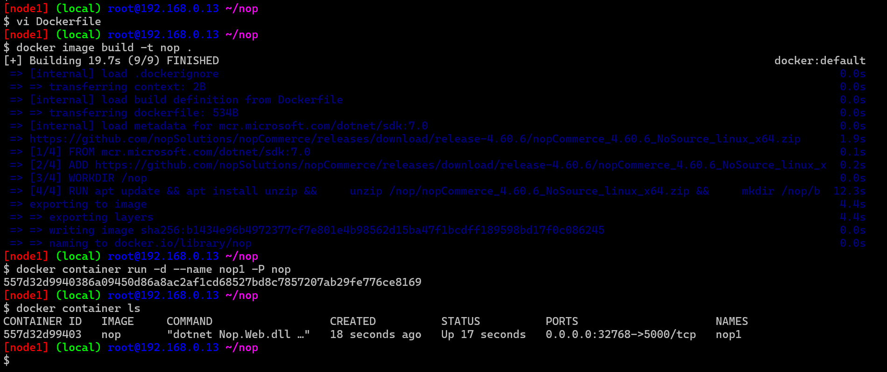
* 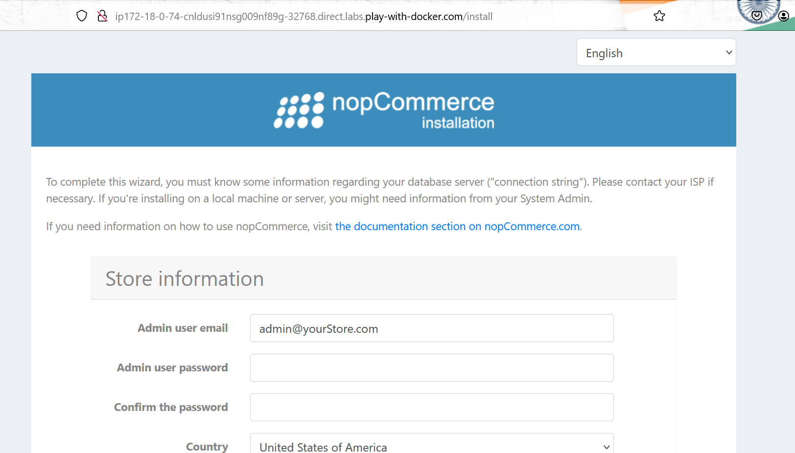
*  the document to host the .net application on 0.0.0.0 refer: https://andrewlock.net/5-ways-to-set-the-urls-for-an-aspnetcore-app/

* ## Setting Environment Variables in the container
* ENV instruction: https://docs.docker.com/reference/dockerfile/#env
* This instruction adds environmental variable in the container and it also allows us to change environmental variables while creating containers
* so when you set a env instruction the advantage which you get it is environment variable added in your container not only into your image but to a container 
* environment variable which is set an operating system level so any programm can access it.
* its add environment variable in the container.
* for the changes done to include environmental varibles

## now dockerfile with env

```
FROM mcr.microsoft.com/dotnet/sdk:7.0
LABEL author="anil" learning="docker" organization="qt"
ADD https://github.com/nopSolutions/nopCommerce/releases/download/release-4.60.6/nopCommerce_4.60.6_NoSource_linux_x64.zip /nop/nopCommerce_4.60.6_NoSource_linux_x64.zip
WORKDIR /nop
RUN apt update && apt install unzip && \
    unzip /nop/nopCommerce_4.60.6_NoSource_linux_x64.zip && \
    mkdir /nop/bin && mkdir /nop/logs
EXPOSE 5000
ENV ASPNETCORE_URLS="http://0.0.0.0:5000"
CMD [ "dotnet", "Nop.Web.dll" ]

```
* 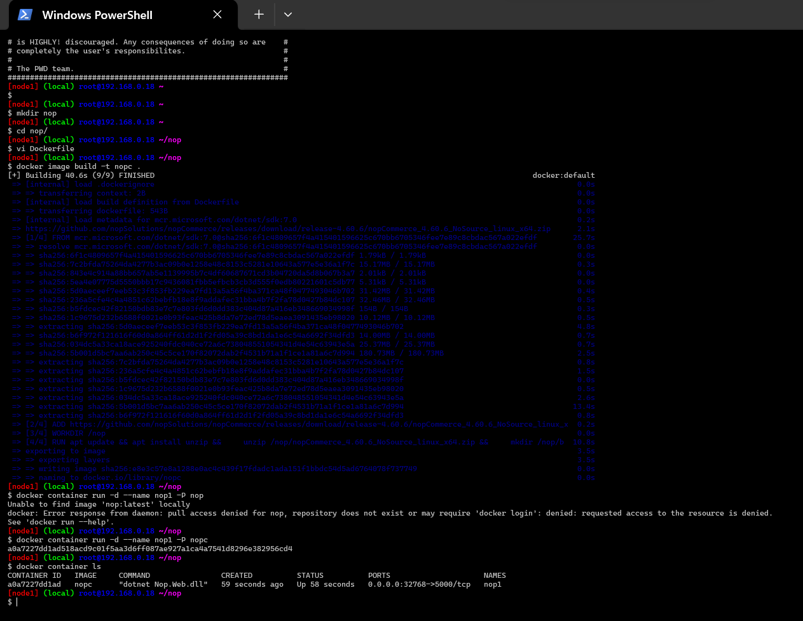
* 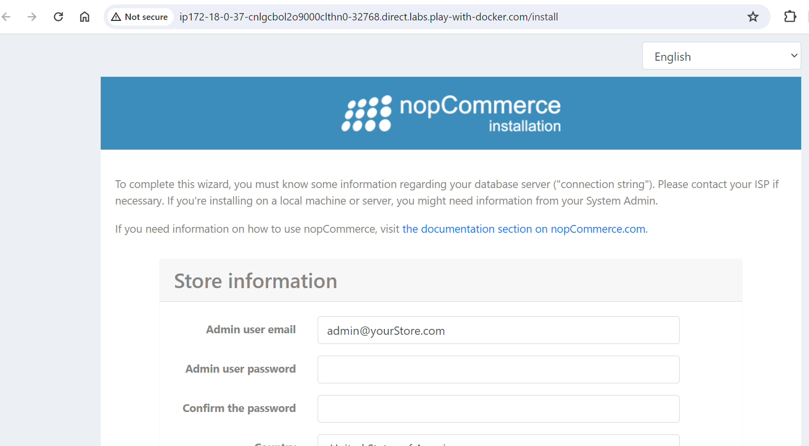
* 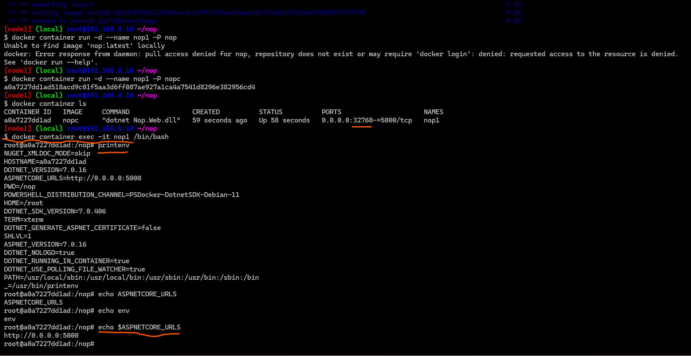
* 
## Run `-it` and `exec -it` difference 
* `docker contairner exec -it nop1 /bin/bash`
* ## exec 
* exec is something which we execute on the container which is an the container running state 
* ## `docker container run -it` 
* while creating the container itself get into the interactive mode.


## Tips
## if you want to experement so do it in intractive mode inside the container with the help of `-it ` command .
* ## alpine cuts the image size coz its a 0nly 7mb linux distro


* 
* 
* 