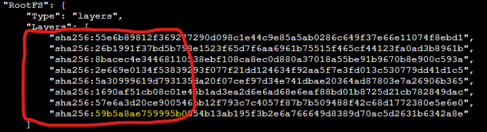
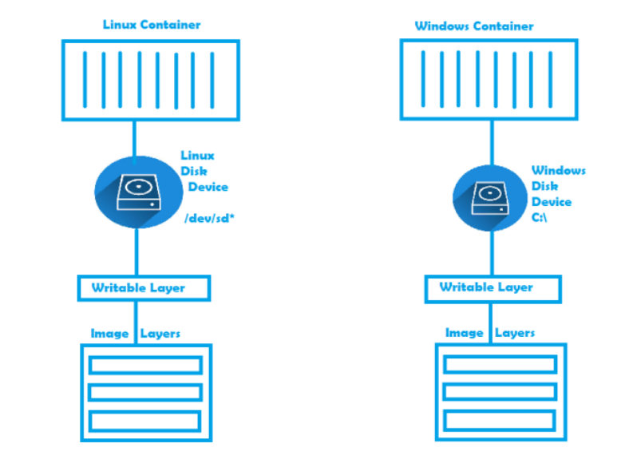
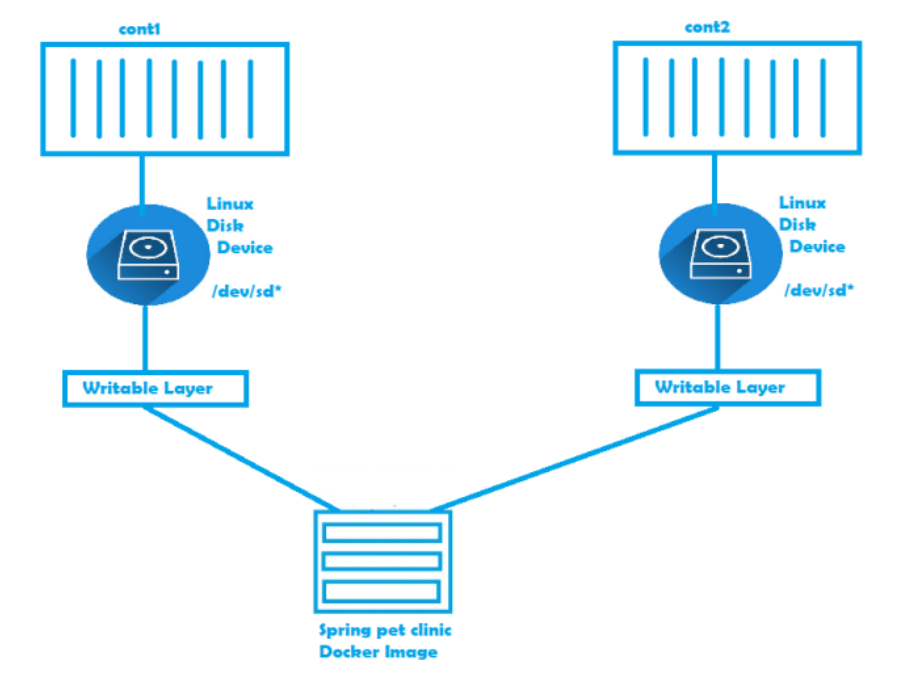

## Image Layers

* A read write layers gets added to every container and image will have read layers

## Layers in Docker image

* Lets pull the alpine image and inspect the image 
```
docker image pull alpine 
docker image inspect alpine

```
* 

## Experiment 1

* Lets create a new image based on alpine `exp1`

```
Dockerfile
FROM alpine
LABEL author="anil"
CMD ["sleep", "1d"]

```  
## `-f`

*The -f flag in Docker's docker build command allows you to specify the path to a Dockerfile other than the default Dockerfile in the current directory. This feature is particularly useful in scenarios where you have multiple Dockerfiles in your project directory, or if you've named your Dockerfile differently for clarity or organization purposes.

* Here are some common scenarios where you might use the -f flag:

* Multiple Dockerfiles: If your project contains multiple Dockerfiles for different purposes (e.g., development, production), you can use the -f flag to specify which Dockerfile you want to use for building your image.

* Non-standard Dockerfile Names: If you've named your Dockerfile differently from the default (Dockerfile), you can use the -f flag to specify the exact filename of the Dockerfile you want to use.

* Dockerfile in a Different Directory: If your Dockerfile is not located in the current directory but in a different directory, you can use the -f flag to specify the path to the Dockerfile.

* Here's an example command using the -f flag to specify a Dockerfile named Dockerfile.prod located in a different directory:
  
* `docker build -f /path/to/Dockerfile.prod .`
* In this command, -f /path/to/Dockerfile.prod specifies the path to the Dockerfile, and . indicates that the build context (i.e., the files used in the build process) is the current directory.
* 
* 
* inspect layers of alpine and exp1 
* 
* both have same layers 
  
* ## Experiment 2 
 
* Lets create a new image based on alpine `exp2`

```
    FROM alpine
    LABEL author="anil"
    ADD 1.txt /
    CMD ["sleep", "1d"]
```

* lets inspect layers of exp2 and alpine 
* exp2 layers
* 
* 

### Experiment 3

* Lets create a new image based on alpine `exp3`
  
* ## In Docker, docker exec is a command-line interface (CLI) command used to execute commands inside a running container. It allows you to interact with a running container by running commands within its environment, similar to how you would run commands in a shell or terminal.
```
FROM alpine 
LABEL author ="anil"
RUN echo "one" > 1.txt
RUN echo "two" > 2.txt
RUN echo "three" > 3.txt
CMD ["sleep", "1d"]

```
* inspect image layers 
* 

* ## Experiment 4 * Lets create a new image based on alpine `exp4`

```
FROM alpine
label author=khaja
RUN echo "one" > 1.txt && \
    echo "two" > 2.txt && \
    echo "three" > 3.txt
CMD ["sleep", "1d"]
```


### Layers in Docker image contd

* Docker image is collection of layers and some metadata
* Docker image gets first set of layers from base image 
* Any Additional changes w.r.t. ADD/COPY create extra layers
* Each RUN instruction which needs some strogae creates layer
* It is recommended to use Multiple commands in RUN instruction rather than multiple RUN  instructions as this leads to too many layers 
* Docker has a filesystem which is aware of layers 
   * ## overlay2 :
                  Overlay2 is a storage driver used by Docker to manage the storage of container images and writable container layers on disk. It is a popular choice for managing container filesystems due to its efficiency, performance, and support for features like copy-on-write and layering.
   * __Copy-on-Write (COW)__: Overlay2 utilizes copy-on-write technology, which means that when changes are made to files within a container, only the modified blocks are written to disk. This reduces the amount of disk space and I/O operations required, improving performance and efficiency.
   * __Layering__: Overlay2 employs a layered filesystem where each Docker image layer is represented by a directory on disk. When you pull or build Docker images, each layer is stored separately, and containers are created by stacking these layers. This layered approach allows for efficient storage and sharing of common layers between images.
   * __overall__: Overlay2 is a robust and efficient storage driver for Docker containers, offering benefits such as reduced disk usage, improved performance, and compatibility with a wide range of environments. It is a key component in managing container filesystems and storage in Docker deployments.

## Docker container layers 

* When a container gets created all the effective read-only-image layers are mounted as a disk to the container 
* Docker creates a thin read write layer for each container 
* Any changes made by container will be stored in this layer
* Problem: When we delete container read-write layer will be deleted
* for the article on layers: 
## Docker image creation and Docker image layers
* https://directdevops.blog/2019/09/26/docker-image-creation-and-docker-image-layers/
* Lets examine the layers: 
* Execute the following command `docker image inspect openjdk:8`
* Total we have seven layers
* Now execute the following command docker image inspect springpetclinic:1.0 and Navigate to layers section
* 
* The result of the observations above are
      * We had one extra copy instruction which had led to creation of new layer for the image springpetclinic:1.0 (which is highlighted in yellow at the bottom)
      * Every instruction (RUN, ADD, COPY etc ) leads to the creation of new image layers
      * All of these layers are combined in the image & as well as container.
      * All of these layers are combined in the image & as well as container.

## for layers and storage Drivers

* refer: https://directdevops.blog/2019/09/27/impact-of-image-layers-on-docker-containers-storage-drivers/

* ## Impact of Image Layers on Docker Containers & Storage Drivers
* __Docker Image Layers and containers__
* Please Refer Here. As the earlier post is prerequisite for understanding this series
* We have understood, Docker images are collection of Layers.
* Now Let us try to understand how the docker image layers will work in the case of container

* Execute the following commands
```
docker container run --name cont1 -d -P springpetclinic:1.0
docker container run --name cont2 -d -P springpetclinic:1.0
```

* As per the image we can make out the changes done in one container will not impact other containers as every container has its own writeable layer.
* To understand actual size on disk, execute the following command `docker ps -s`
* 
* In the above image 
* __size__         => amount of data used for writable layer
* __virtual size__ => virtual size of container i.e. image layers size plus writable layer size
      * When any container tries to change the contents of the existing files in image layers (As we are aware image layers are readonly), then the file which is supposed to be changed is copied into the write layer of the container and the modifications will be present only for the container changing it.
      * One of the major advantage with this approach is storage optimization in terms of space occupied on disk in the case of multiple container running 
      * There is also one challenge. The write layer is avaiable only as long as container is alive. The moment container is removed from the machine, the writable layer is also deleted.

* ## To overcome this challenge lets understand
     * __Storage Drivers__
     * __Persist Data in Containers__

* ## Storage Drivers
     * Storage Drivers allow you to create the data in the writable layer of the container
     * Docker supports the following storage drivers
          * ## overlay2 :
               * Preferred storage driver for all linux distributions
               * Requires no extra configuration
          * ## aufs :
               * is the preferred storage driver for Docker 18.06 and older, when running on Ubuntu 14.04 on kernel 3.13 which has no support for overlay2
          * ## devicemapper :
               * Requires direct-lvm for production environments
                 zero configuration is available but has poor performance
                 devicemapper was the recommended storage driver for CentOS and RHEL, as their kernel version did not support overlay2, However current versions of Centos & RHEL support overlay2 now
        * ## btrfs:
               * used if the hosts file system is btrfs
                 snapshots are supported
        * ## zfs:
               * used if the hosts file system is zfs
               * snapshots are supported  
* To know your current storage driver, execute “`docker info“ and you should see Section Storage Driver. The docker info output would be like

```
Client:
 Debug Mode: false

Server:
 Containers: 2
  Running: 2
  Paused: 0
  Stopped: 0
 Images: 5
 Server Version: 19.03.1
 Storage Driver: overlay2
  Backing Filesystem: xfs
  Supports d_type: true
  Native Overlay Diff: true
 Logging Driver: json-file
 Cgroup Driver: cgroupfs
 Plugins:
  Volume: local
  Network: bridge host ipvlan macvlan null overlay
  Log: awslogs fluentd gcplogs gelf journald json-file local logentries splunk syslog
 Swarm: inactive
 Runtimes: runc
 Default Runtime: runc
 Init Binary: docker-init
 containerd version: 894b81a4b802e4eb2a91d1ce216b8817763c29fb
 runc version: 425e105d5a03fabd737a126ad93d62a9eeede87f
 init version: fec3683
 Security Options:
  apparmor
  seccomp
   Profile: default
 Kernel Version: 4.4.0-161-generic
 Operating System: Alpine Linux v3.10 (containerized)
 OSType: linux
 Architecture: x86_64
 CPUs: 8
 Total Memory: 31.4GiB
 Name: node1
 ID: GMFB:TJ5T:GKDZ:3TQO:I52L:7OC4:WVGJ:INCL:J7MW:O626:GODK:URGN
 Docker Root Dir: /var/lib/docker
 Debug Mode: true
  File Descriptors: 40
  Goroutines: 54
  System Time: 2019-09-27T13:11:57.45011439Z
  EventsListeners: 0
 Registry: https://index.docker.io/v1/
 Labels:
 Experimental: true
 Insecure Registries:
  127.0.0.1
  127.0.0.0/8
 Live Restore Enabled: false
 Product License: Community Engine
```     
* To Know more about configuration, click on storage driver
* aufs
* Btrfs
* Device Mapper
* Overlay
* Zfs
* VFS storage driver is still
* What is better for my workload. refer: https://docs.docker.com/storage/storagedriver/select-storage-driver/#suitability-for-your-workload   

##