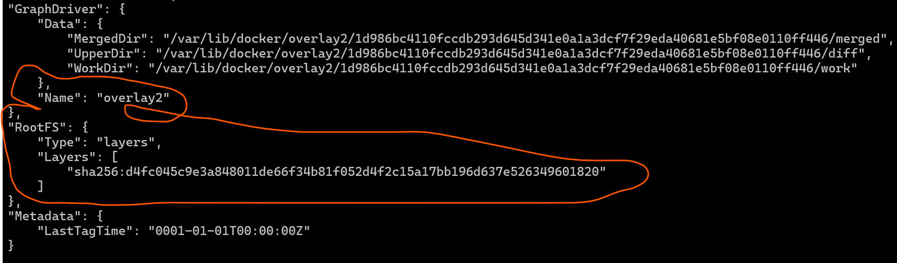
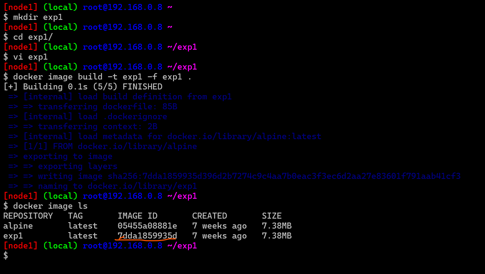

## Image Layers

* A read write layers gets added to every container and image will have read layers

## Layers in Docker image

* Lets pull the alpine image and inspect the image 
```
docker image pull alpine 
docker image inspect alpine

```
* 

## Experiment 1

* Lets create a new image based on alpine `exp1`

```
Dockerfile
FROM alpine
LABEL author="anil"
CMD ["sleep", "1d"]

```  
## `-f`

*The -f flag in Docker's docker build command allows you to specify the path to a Dockerfile other than the default Dockerfile in the current directory. This feature is particularly useful in scenarios where you have multiple Dockerfiles in your project directory, or if you've named your Dockerfile differently for clarity or organization purposes.

* Here are some common scenarios where you might use the -f flag:

* Multiple Dockerfiles: If your project contains multiple Dockerfiles for different purposes (e.g., development, production), you can use the -f flag to specify which Dockerfile you want to use for building your image.

* Non-standard Dockerfile Names: If you've named your Dockerfile differently from the default (Dockerfile), you can use the -f flag to specify the exact filename of the Dockerfile you want to use.

* Dockerfile in a Different Directory: If your Dockerfile is not located in the current directory but in a different directory, you can use the -f flag to specify the path to the Dockerfile.

* Here's an example command using the -f flag to specify a Dockerfile named Dockerfile.prod located in a different directory:
  
* `docker build -f /path/to/Dockerfile.prod .`
* In this command, -f /path/to/Dockerfile.prod specifies the path to the Dockerfile, and . indicates that the build context (i.e., the files used in the build process) is the current directory.
* 
* 