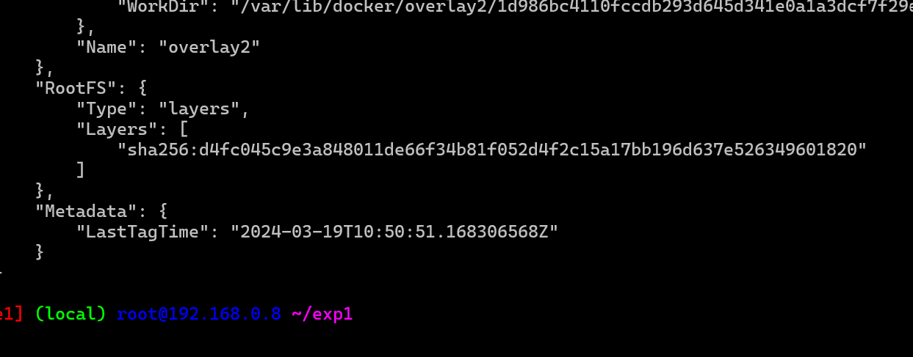
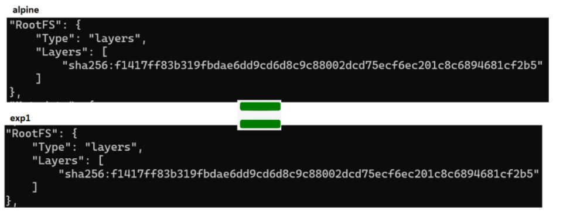
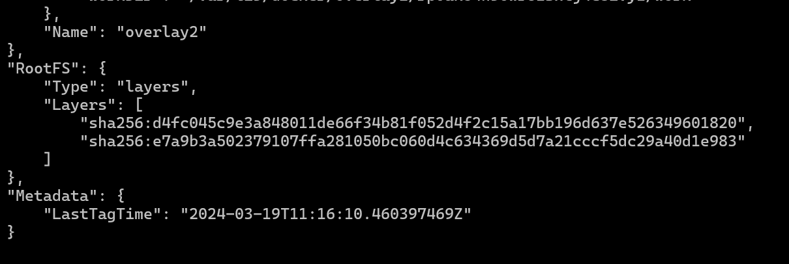
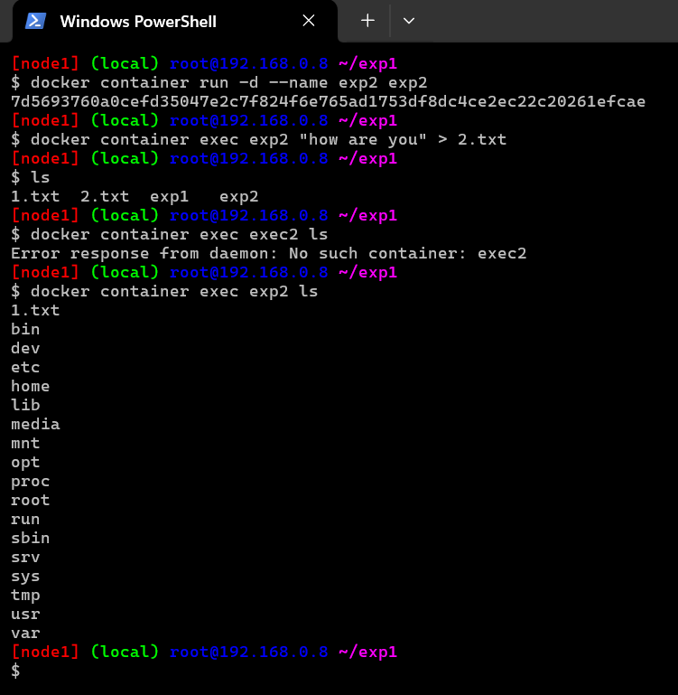
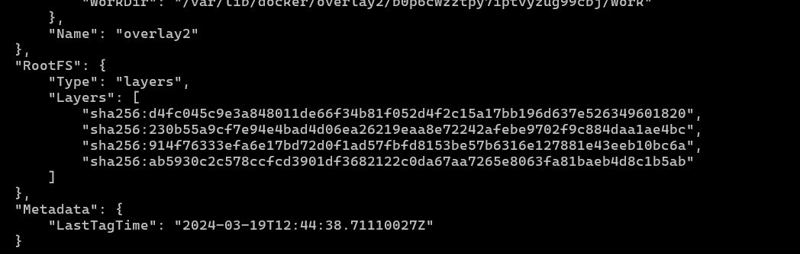
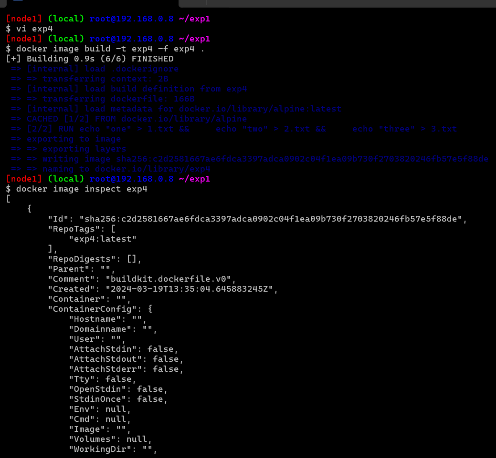
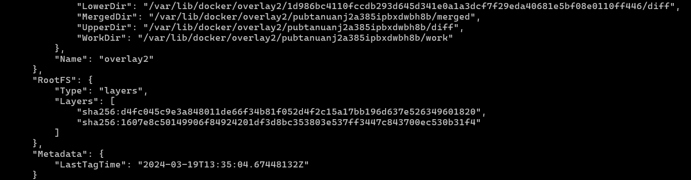

## Image Layers

* A read write layers gets added to every container and image will have read layers

## Layers in Docker image

* Lets pull the alpine image and inspect the image 
```
docker image pull alpine 
docker image inspect alpine

```
* 

## Experiment 1

* Lets create a new image based on alpine `exp1`

```
Dockerfile
FROM alpine
LABEL author="anil"
CMD ["sleep", "1d"]

```  
## `-f`

*The -f flag in Docker's docker build command allows you to specify the path to a Dockerfile other than the default Dockerfile in the current directory. This feature is particularly useful in scenarios where you have multiple Dockerfiles in your project directory, or if you've named your Dockerfile differently for clarity or organization purposes.

* Here are some common scenarios where you might use the -f flag:

* Multiple Dockerfiles: If your project contains multiple Dockerfiles for different purposes (e.g., development, production), you can use the -f flag to specify which Dockerfile you want to use for building your image.

* Non-standard Dockerfile Names: If you've named your Dockerfile differently from the default (Dockerfile), you can use the -f flag to specify the exact filename of the Dockerfile you want to use.

* Dockerfile in a Different Directory: If your Dockerfile is not located in the current directory but in a different directory, you can use the -f flag to specify the path to the Dockerfile.

* Here's an example command using the -f flag to specify a Dockerfile named Dockerfile.prod located in a different directory:
  
* `docker build -f /path/to/Dockerfile.prod .`
* In this command, -f /path/to/Dockerfile.prod specifies the path to the Dockerfile, and . indicates that the build context (i.e., the files used in the build process) is the current directory.
* 
* 
* inspect layers of alpine and exp1 
* 
* both have same layers 
  
* ## Experiment 2 
 
* Lets create a new image based on alpine `exp2`

```
    FROM alpine
    LABEL author="anil"
    ADD 1.txt /
    CMD ["sleep", "1d"]
```

* lets inspect layers of exp2 and alpine 
* exp2 layers
* 
* 

### Experiment 3

* Lets create a new image based on alpine `exp3`
  
* ## In Docker, docker exec is a command-line interface (CLI) command used to execute commands inside a running container. It allows you to interact with a running container by running commands within its environment, similar to how you would run commands in a shell or terminal.
```
FROM alpine 
LABEL author ="anil"
RUN echo "one" > 1.txt
RUN echo "two" > 2.txt
RUN echo "three" > 3.txt
CMD ["sleep", "1d"]

```
* inspect image layers 
* 

* ## Experiment 4 * Lets create a new image based on alpine `exp4`

```
FROM alpine
label author=khaja
RUN echo "one" > 1.txt && \
    echo "two" > 2.txt && \
    echo "three" > 3.txt
CMD ["sleep", "1d"]
```



### Layers in Docker image contd

* Docker image is collection of layers and some metadata
* Docker image gets first set of layers from base image 
* Any Additional changes w.r.t. ADD/COPY create extra layers
* Each RUN instruction which needs some strogae creates layer
* It is recommended to use Multiple commands in RUN instruction rather than multiple RUN  instructions as this leads to too many layers 
* Docker has a filesystem which is aware of layers 
   * ## overlay2 :
                  Overlay2 is a storage driver used by Docker to manage the storage of container images and writable container layers on disk. It is a popular choice for managing container filesystems due to its efficiency, performance, and support for features like copy-on-write and layering.
   * __Copy-on-Write (COW)__: Overlay2 utilizes copy-on-write technology, which means that when changes are made to files within a container, only the modified blocks are written to disk. This reduces the amount of disk space and I/O operations required, improving performance and efficiency.
   * __Layering__: Overlay2 employs a layered filesystem where each Docker image layer is represented by a directory on disk. When you pull or build Docker images, each layer is stored separately, and containers are created by stacking these layers. This layered approach allows for efficient storage and sharing of common layers between images.
   * __overall__: Overlay2 is a robust and efficient storage driver for Docker containers, offering benefits such as reduced disk usage, improved performance, and compatibility with a wide range of environments. It is a key component in managing container filesystems and storage in Docker deployments.

