* ## Stateful Application and Stateless Applications
* Stateful applications use local storage to store any state 
* Stateless applications use external systems (database, blobstorage etc) to store the state 
* We need not do anything special if your application is stateless in terms of writable layer, but if it stateful we need to preserve the state.
* ## Solving the Problem with Writable Layers
* Lets create a mysql container : https://hub.docker.com/_/mysql
* command
* `docker container run -d --name mysqldb -e MYSQL_ROOT_PASSWORD=rootroot -e MYSQL_DATABASE=employees -e MYSQL_USER=qtdevops -e MYSQL_PASSWORD=rootroot -P mysql:8`
* To login into container
* `docker container exec -it mysqldb mysql --password=rootroot`
* search on google __create table in mysql__
* To create a table
```
use employees;
CREATE TABLE Persons (
    PersonID int,
    LastName varchar(255),
    FirstName varchar(255),
    Address varchar(255),
    City varchar(255)
);
Insert into Persons Values (1,'test','test', 'test', 'test');
Select * from Persons;
```
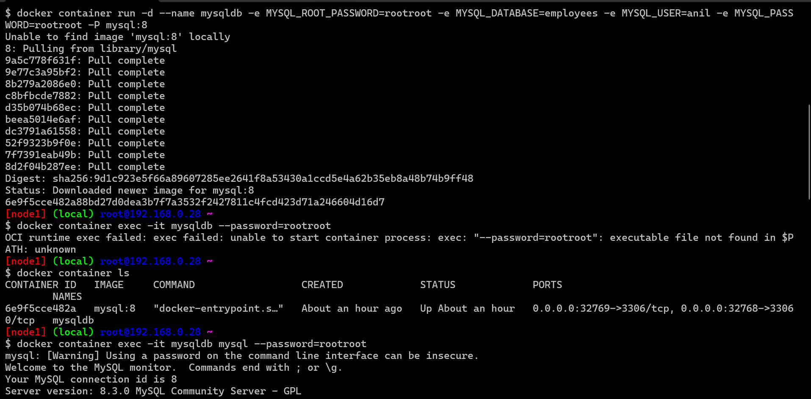
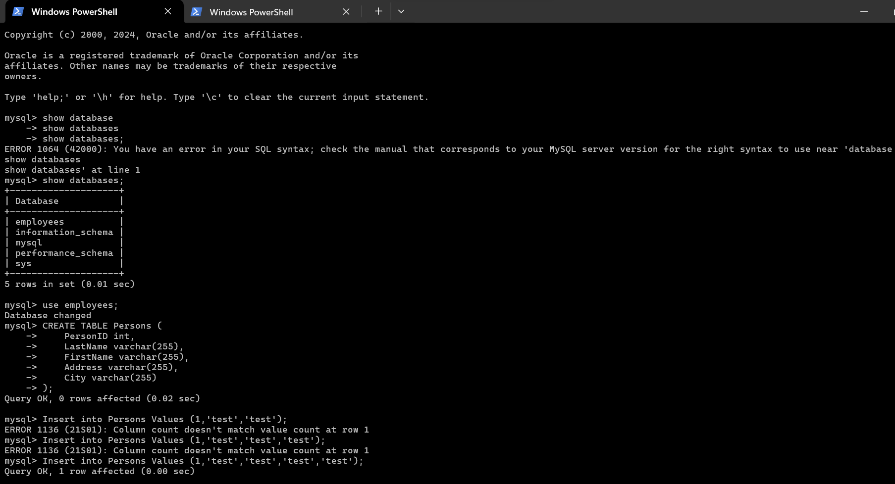
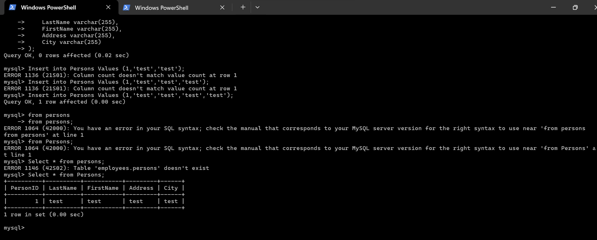

* Now if we remove the container we loose the data
* to fix the problem with data looses, __Docker has volumes__
* Volume can exist even after docker container is deleted.
* We can attach volumes to the other containers as well 
* for this volume to work , we need to know the folder of which data will be preserved 
* Lets explore __docker volume subcommands__  
* 
* docker volume creates a storage according to the driver specified. The default driver is local i.e. the volume is created in the machine where docker is executing

* ## Docker Volumes

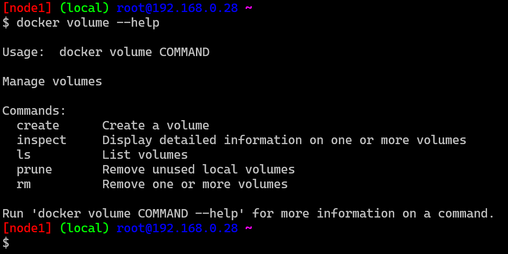
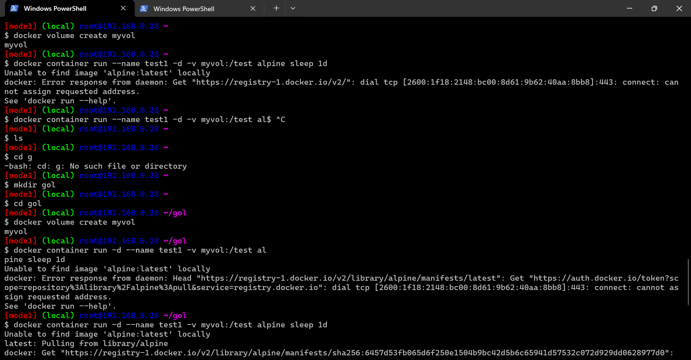
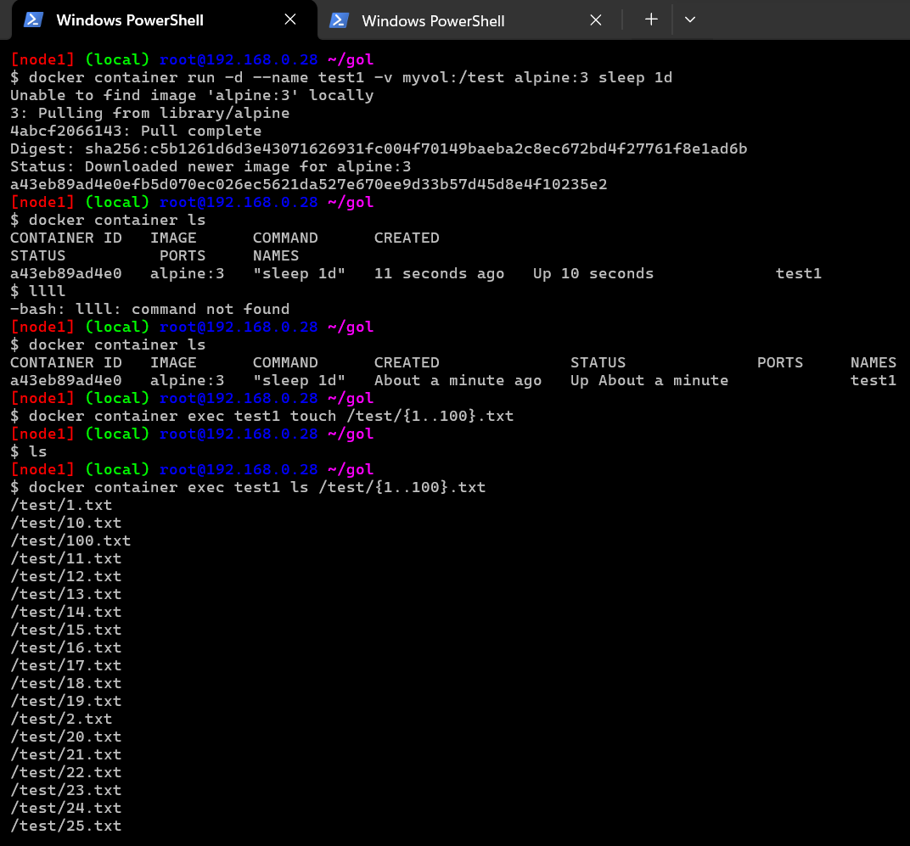
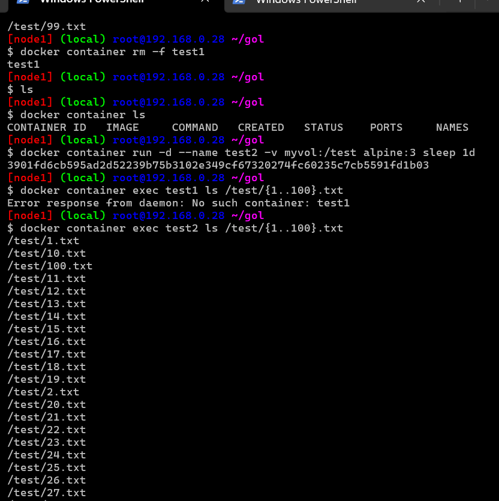
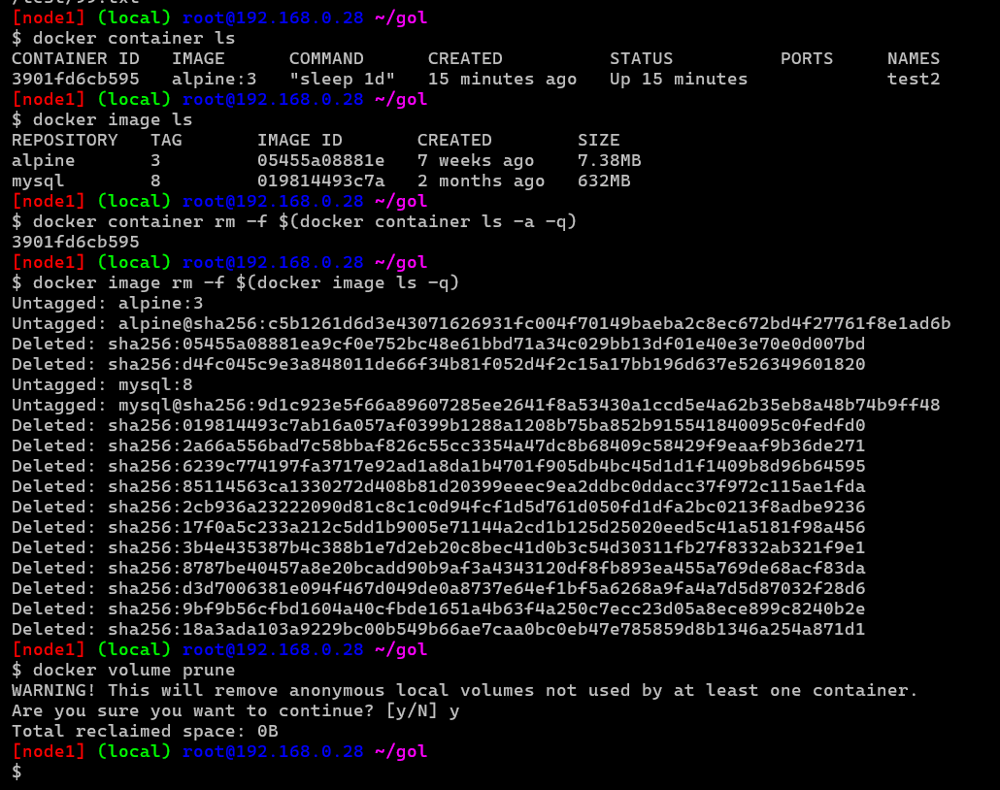      
`docker volume prune ` any image that is not in use it will remove 
* refer: https://directdevops.blog/2019/10/03/docker-volumes/

* ## Data Persistence in Docker for Stateful Applications
  
* Kindly refer the following articles if you are not aware of layer
     * Image Layers
     * Impact of Layers on Container
* By default, all the files created/modified by the containers reside on the writable layer of the container.
* The problem with the writable layer of the container is "Writable layer will be deleted once the container is deleted"
* To persist the data into the Docker Host (Machine on which Docker is installed) Docker provides the following options
      * ## Volumes:
           * Stored in the hostfile system managed by Docker (/var/lib/docker/volumes/ on Linux).
           * Non Docker Processes should not modify the file system
      * ## Bind Mounts:
           * Can be stored any where on the host system.
           * Non-Docker Processes can modify
      * ## tmpfs Mounts:
           * Store on the host systems memory, never written to file system

* ## Docker Volumes
* Docker Volumes are preferred mechanisms for persisting data generated by and used by Docker Containers.
* Advantages
       * Easier to backup or migrate that bind mounts
       * Can be managed by Docker CLI or the API
       * Work in both Linux & Windows Containers
       * Volume Drivers lets to store volumes on remote hosts or cloud providers, encryption can be added.
       * Volumes donot increase the size of the docker containers writable layer as the volumes’s contents exist outside of container lifecycle.   
* ## Creating and Managing Docker Volumes
* Two Options Exist for the Creation of Docker Volume
* ## -v
       * Consists of three fields separated by :
       * fields order should be correnct
       * syntax: __-v <name of volume>:<path to mount in container>:<options>__ 
* Lets Experiment with volumes using __-v__ and __docker volume command__   
* Create a docker volume called as my-tools. Execute the following commands on docker host
```
docker volume create my-tools

docker volume ls 
##Output##
DRIVER              VOLUME NAME
local               my-tools

docker volume inspect my-tools
##output##
[
    {
        "CreatedAt": "2019-10-03T13:21:12Z",
        "Driver": "local",
        "Labels": {},
        "Mountpoint": "/var/lib/docker/volumes/my-tools/_data",
        "Name": "my-tools",
        "Options": {},
        "Scope": "local"
    }
]
```
* Mount the docker volume to alpine container using -v command
* `docker container run --name cont1 -d -v my-tools:/tools alpine sleep 1d`
* Execute inspect command & navigate to mount on container cont1 & execute other commands as shown below
```
docker container inspect cont1

##Output##
"Mounts": [
            {
                "Type": "volume",
                "Name": "my-tools",
                "Source": "/var/lib/docker/volumes/my-tools/_data",
                "Destination": "/tools",
                "Driver": "local",
                "Mode": "z",
                "RW": true,
                "Propagation": ""
            }
        ]

docker container exec cont1 touch /tools/1.txt
docker container exec cont1 touch /tools/2.txt
docker container exec cont1 touch /tools/3.txt
docker container exec cont1 ls /tools
##Output##
1.txt
2.txt
3.txt

```
* Lets mount the same volume on different container, in different path and see the contents of volume
```
docker container run --name cont2 -d -v my-tools:/mytools tomcat:8

docker container exec cont2 ls /mytools
##Output##
1.txt
2.txt
3.txt
```

* ## –mount:
       * Initially was used only for docker services, now can be used for standalone containers as well
       * Syntax: –mount ‘type=<bind/volume/tmpfs>,source/src=<nameofvolume>,destination/dst/target=<mountpath in container>,
       * refer here for complete syntax : https://docs.docker.com/storage/volumes/#choose-the--v-or---mount-flag
       * Lets use the same my-tools volume using –mount
       * Mount the docker volume to alpine container using –mount command 
```
docker container run --name cont3 -d --mount 'type=volume,src=my-tools,dst=/tools' alpine sleep 1d

```
* Execute the rest of commands as mentioned above
* ## Docker Volume Drivers
* Docker volume driver can be specified while creating a volume or when to start the container
* for Docker Volume Drivers: https://hub.docker.com/search?q=&type=plugin&category=volume
* for azure persistent volumes: 
* for aws persistent data volume
* ## References
* for Bind Mounts: https://docs.docker.com/storage/bind-mounts/
* for tmpfs mounts: https://docs.docker.com/storage/tmpfs/
* ## Other Way of Creating Docker Volume
* In the Dockerfile use the VOLUME instruction.

## Experiments

* Create a mysql container
* 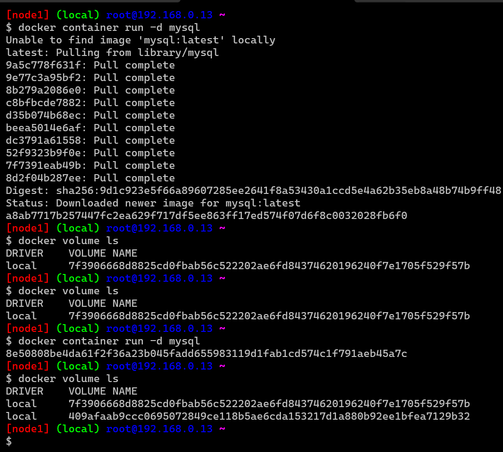 
* and this is the way creating volume
 
* create a postgresql container
* 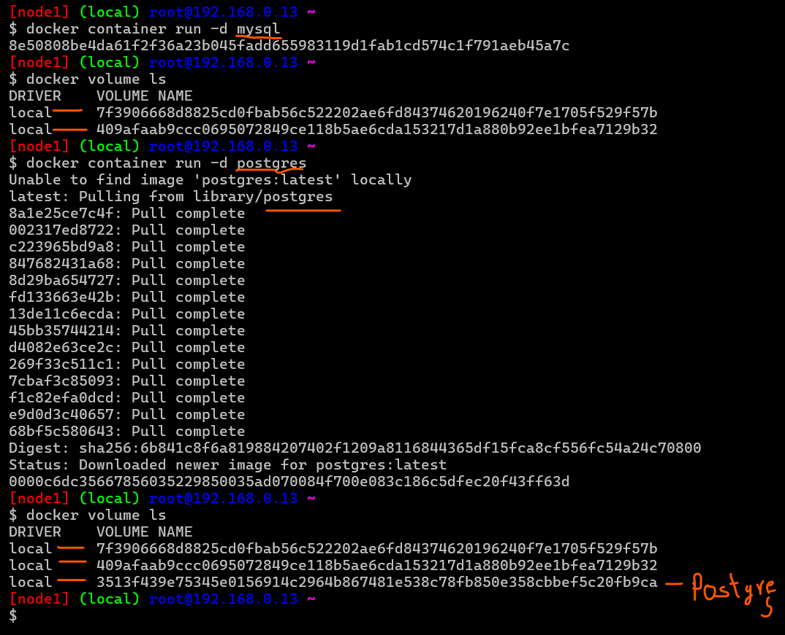
 
* whenever you create a container it will automatically create a volume also
* list all the volumes
* inspect all the volumes
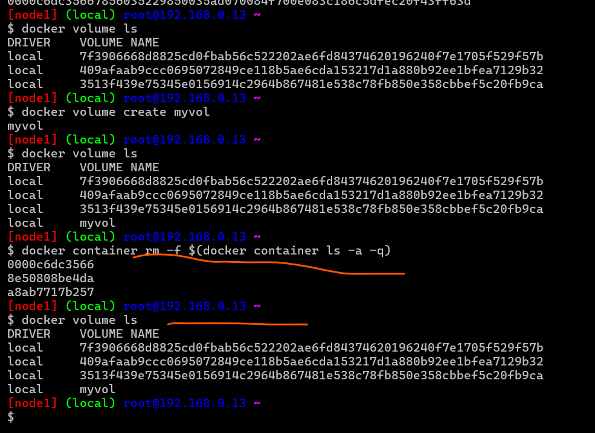
* There are 2 types of volume creation 
      * when you create a an image 
      * using command `docker volume create (volume name)` 
* create volume `docker volume create myvol`
* inspect myvol
* Figure out locations of volumes in your local systems
* __And to delete a specific volume use this command:__
* `docker volume rm [volume_name]`

* ## KeyPoints
* Always ensure volumes are automatically created for the stateful applications as part of Dockerfile (VOLUME instruction)
* Volumes are of two types
       * Explicity created (docker volume create myvol)
       * automatically created as part of container creation
* Ensure we have knowledge on necessary folders where the data is stored and use volumes for it  

##