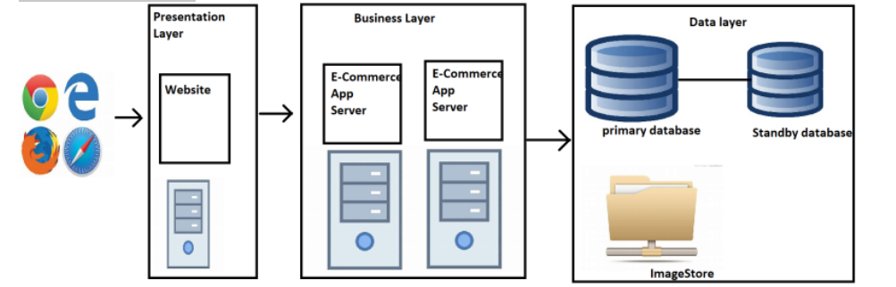
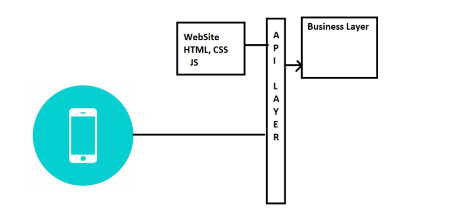
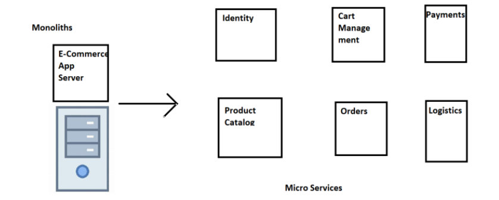
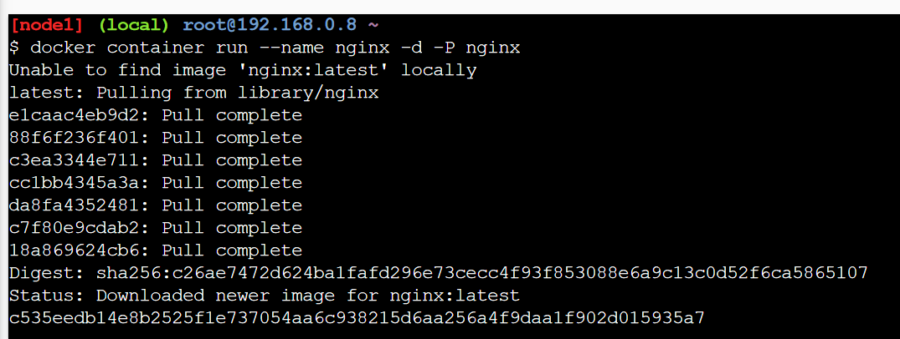
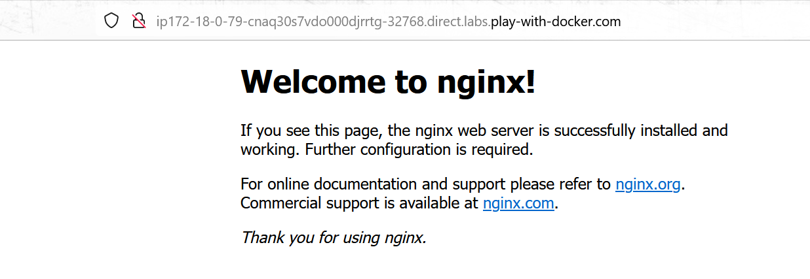
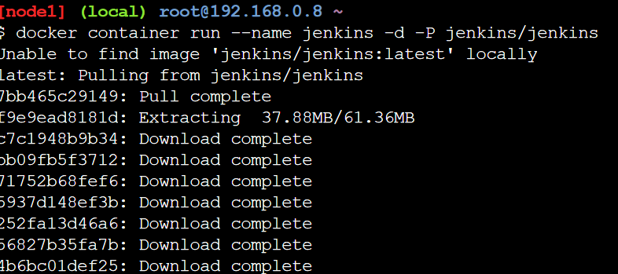
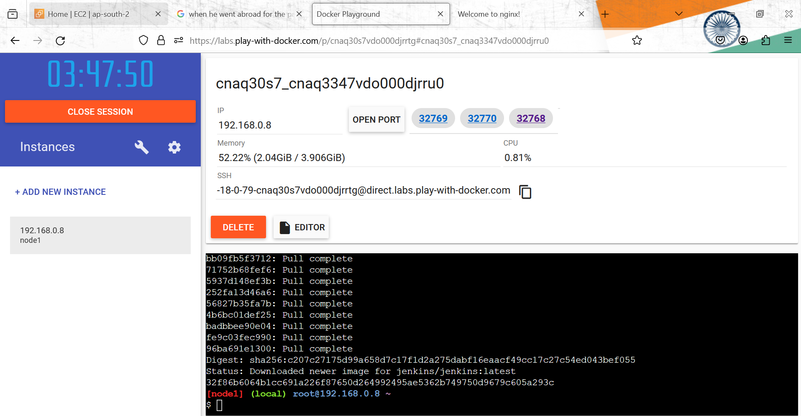
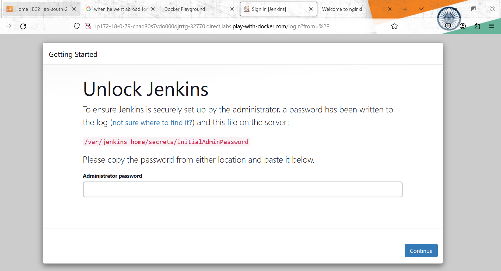
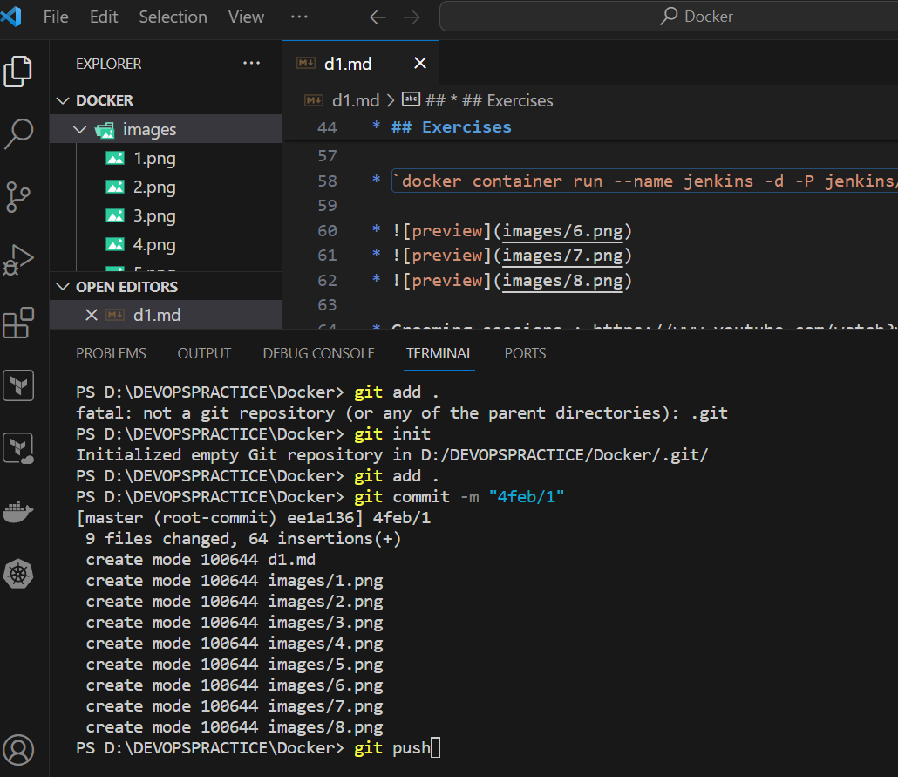

##                          DOCKER                                       ##

__Story of an organization and Problem introduction__

* Organization name: Contoso
* Application: ecommerce
* Architecture: 

## Problems: 
* Different front-ends (ios, Andriod)
     * Accesibility
     * Cross platform

* Deployment of new features:
    * typically are having more downtimes
    * Zero Down time Deployments
    * Faster Deployments

* Contoso wants to run this application on any cloud or on-premises
    * Portability

* De Composing application into smaller services according the business needs 

* __Running all of your Application in 1 server called as Monolith__.
 
* __Breaking uour problems into busseness problems and trying to run on indivisual server this is called Micro Services__.

* __Breaking your Applications into smaller component so that it is easly maintianable and then whenever you want to make changes you are not going to changes whole system, you are just changing 1 / particular service and this will not take much of time__.

* __My hole application is broken into 6 different part which runs on a 6 different place so now just updating identity. Server is much easier to me rather than updating a hole application 1 point. This is a new way, every company using this Approach__.
  
* Updating any microservice can be done independently
* Re using microservices is much easier.
* Scaling for microservice is much easier and cheaper compared to Scaling monolith.

## Solution: 

   * Container Technology __( Docker )__ 
   * Container Orchestration __( Kubernetes )__
 *
* ## Exercises 
* i want to run nginx and jenkins on a single machine/server we can run 2 nginx and jenkins etc on 1 server.

* Docker play: https://labs.play-with-docker.com/

* Trying to run ngins in docker play

* `docker container run --name nginx -d -P nginx`

* 
* 

* trying to run jenkins 

* `docker container run --name jenkins -d -P jenkins/jenkins`

* 
* 
* 

* Grooming sessions : https://www.youtube.com/watch?v=6hRzUNLmZ0E&list=PLuVH8Jaq3mLsYeR_xaW0RW1KR9BZKFBT4 

### .md file 
